# Bayesian Statistics
| georgos
  


1)  Sample survey: Suppose we are going to sample 100 individuals from
a county (of size much larger than 100) and ask each sampled person
whether they support policy Z or not. Let $Y_i = 1$ if person $i$ in the sample
supports the policy, and $Y_i = 0$ otherwise.

a) Assume $Y_1,...,Y_{100}$ are, conditional on $\theta$, i.i.d. binary random variables with expectation $\theta$. Write down the joint distribution of 
$Pr(Y_1 =y_1, ... , Y_{100} = y_{100}| \theta)$ 
in a compact form. 
Also write down the form of
$Pr(\sum_{i=1}^n Y_i = y| \theta)$.


The generic random variable $Y_i|\theta$ is distributed as a Bernoulli with parameter $\theta$ because the phenomenon is discrete and binary. So we can write:
$$ Y_i|\theta \sim Bern(\theta) $$
$$Bern(\theta) = \theta\,^{y_i}(1-\theta)^{1-y_i}$$
and because the variables are **conditional independents** respect to $\theta$, the joint distribution can be factorize as follow:

$$Pr(Y_1 =y_1, ... , Y_{n} = y_{n}| \theta) = \prod_{i=1}^n Pr(Y_i=y_i|\theta) $$
and for the Bernoulli case we can specify:
$$\prod_{i=1}^n Pr(Y_i=y_i|\theta) = \prod_{i=1}^n \theta\,^{y_i}(1-\theta)^{1-y_i} = \theta\,^{\sum_{i=1}^n y_i}(1-\theta)^{n-\sum_{i=1}^n y_i}$$
the whole joint distribution (conditional to $\theta$) is a repetition of independent and identically distributed Bernoulli experiments: so this distribution can be also written as a $Bin(s,n,\theta)$ where s is the number of successes, n the total number of repetition and $\theta$ the probability to obtain a success.
This is possible because $s= \sum_{i=1}^n y_i$ is a **sufficient statistics**: this means that using s it is possible to obtain the same information of the original distribution.
It is now simple to recognize that the second distribution is a $Binomial$ and in particular:
$$s= \sum_{i=1}^n y_i$$
$$\sum_{i=1}^n Y_i = y| \theta \sim Bin(s= \sum_{i=1}^n y_i,n,\theta)) $$
$$Bin(s= \sum_{i=1}^n y_i,n,\theta) = {n \choose s} \theta\,^{s}(1-\theta)^{n-s}   $$

```r
n = 100
theta = 1/2

f = function(n,theta){
    # realization from the joint Bernoullis
    s = sample(c(0,1),n, prob = c(1-theta,theta),replace = TRUE)
    res = sum(s)
    return(res)
}

multiBern = function(n,theta,N){
    # multiple realization from the joint Bernoulli
    r = rep(0,N)
    for(i in 1:N){
        r[i] = f(n,theta)
    }
    return (r)
}
N = 1000
h = multiBern(n,theta,N)

par(mfrow=c(1,2))


gg = rbinom(N,n,theta)
hist(gg,freq = FALSE, xlab = "s",col="violet",breaks = 20,main=paste("sample from Binomial"),
     xlim = c(35,65))
lines(density(gg),col="blue")
hist(h,freq = FALSE,col="green",breaks = 20, main=paste("samples multi Bernoulli"),xlim = c(35,65))
lines(density(gg),col="blue")
```

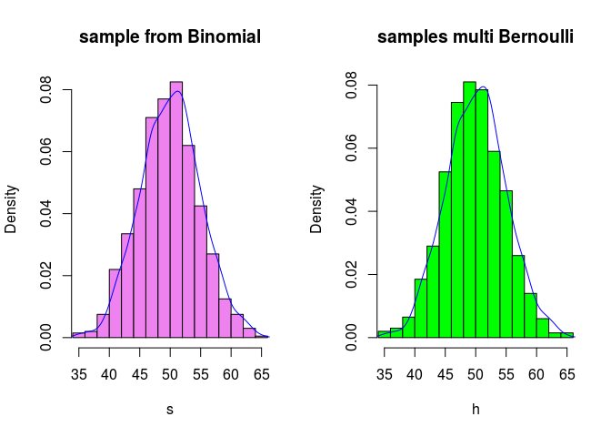<!-- -->

b) For the moment, suppose you believed that 
$\theta \in \{ 0.0, 0.1, ... , 0.9, 1.0 \}$.
Given that the results of the survey 
were $\sum_{i=1}^n Y_i  = 57$ , 
compute
$$ Pr(\sum_{i=1}^n Y_{i} = 57 | \theta)$$ 
for each of these 11 values of $\theta$ 
and plot these probabilities as a function of $\theta$.

When we compute this we obtain a function of $\theta$ given the data:
in this case a "discrete likelihood", a discrete statistical model chosen to represent the behavior of the phenomenon.

```r
par(mfrow=c(1,1))

theta = seq(0.0,1.0,0.1)
n = 100
Y = 57
prob = dbinom(Y,n,theta)

plot(theta,prob, col="green", lwd=2,xlab = expression(theta),ylab = "discrete likelihood")
grid()
```

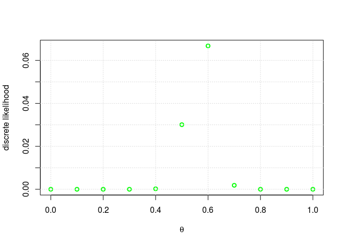<!-- -->

c) Now suppose you originally had no prior information to believe one of
these $\theta$-values over another, and so 
$Pr(\theta = 0.0) = Pr(\theta = 0.1) = ... = Pr(\theta = 0.9) = Pr(\theta = 1.0)$. 
Use Bayes rule to compute $\pi(\theta|\sum_{i=1}^n Y_i  = 57)$ 
for each $\theta$-value. Make a plot of this posterior distribution as a
function of $\theta$.

In this particular case we are dealing with a discrete distribution for $\theta$ and the Bayes' rule can be written in this form:

$\pi(\theta_j|\sum_{i=1}^n Y_i  = 57) = 
\dfrac{Pr(\sum_{i=1}^n Y_{i} = 57|\theta_j)\pi(\theta_j)}
{\sum_{j=1}^{\theta} Pr(\sum_{i=1}^n Y_{i} = 57|\theta_j) \pi(\theta_j)}$

In this case all the prior are the same and have mass 1 over the cardinality of the parameter space:

$$\pi(\theta_j) = 1/|\Theta| $$

Obviously this prior has no influence on the posterior distribution and all the information is inside the statistical model chosen for the data. 

```r
par(mfrow=c(1,3))
prior = 1/length(theta)
den = sum(dbinom(Y,n,theta)*prior)
posterior = (dbinom(Y,n,theta)*prior)/den

plot(theta,prob,ylab = "discrete likelihood",col = "blue")
grid()
plot(theta,rep(prior,length(theta)),ylab = "uniform prior", col = "green")
grid()
plot(theta,posterior, col="red", ylab = "posterior", xlab = "theta|y")
grid()
```

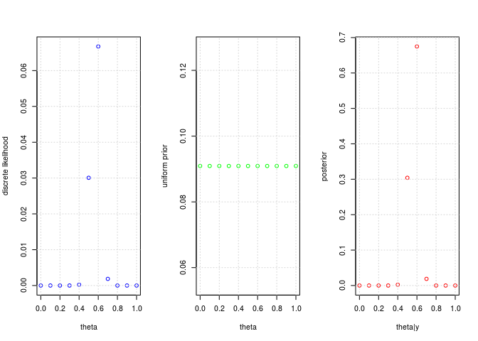<!-- -->


d) Now suppose you allow $\theta$ to be any value in the interval $\Theta=[0, 1]$. 
Using the uniform prior density for $\theta \in [0,1]$, so that $\pi(\theta) = I_{[0,1]}(\theta)$, 
plot $\pi(\theta) \times Pr(\sum_{i=1}^n Y_i  = 57|\theta)$ as a function of $\theta$.

In  this case the result is similar but obviously we have to deal with an integral instead of a summation.

$\pi(\theta|\sum_{i=1}^n Y_i = 57) = 
\dfrac{Pr(\sum_{i=1}^n Y_{i} = 57|\theta)\pi(\theta)}
{\int_{\Theta} Pr(\sum_{i=1}^n Y_{i} = 57|\theta) \pi(\theta)\,d\theta}$


```r
par(mfrow=c(2,2))

curve(dbinom(Y,n,x),ylab = "distro statistical model given the data", xlab = "theta")
curve(dunif(x,0,1),col="red",ylab = "prior", xlab = "theta")
curve((dunif(x,0,1)*dbinom(Y,n,x)),col="green",ylab = "distro proportional to posterior", xlab = "theta")
den = integrate(function(x) dunif(x,0,1)*dbinom(Y,n,x),0,1)[1]$value
curve((dunif(x,0,1)*dbinom(Y,n,x))/den,col="blue", ylab = "posterior",xlab = "theta|y")
```

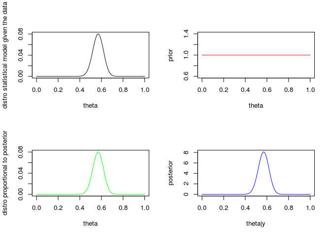<!-- -->
Also in this case all the information is inside the statistical model and the prior has no effect on the posterior shape.

e) As discussed in this chapter, the posterior distribution of $\theta$ is $Beta (1+57, 1+100-57)$. Plot the posterior density as a function of $\theta$. Discuss the relationships among all of the plots you have made for this exercise.

What we have seen is a degenerate case where the Beta distribution is equal to the uniform distribution: this is true when the parameters a and b are equal to 1.

It's a particular case of a more general behavior for this two distribution: in fact using as model for the data a Binomial and as prior a Beta(a,b) we know, for the theory of conjugacy, that the posterior will be always proportional to the prior and in particular equal to a new Beta(a_post,b_post) with different parameters that contain inside the information given by the data and given by the prior. For this model:

$$a_{posterior} = a_{prior} + s  $$
$$b_{posterior} = b_{prior} - s + n  $$

```r
par(mfrow=c(1,2))
posterior_curve = function(x,a,b,Y,n,inf,sup){
    
    num = dbeta(x,a,b)*dbinom(Y,n,x)
    den = integrate(function(x) dbeta(x,a,b)*dbinom(Y,n,x),inf,sup)[1]$value
    
    return (num/den)
}
a = 1
b = 1
a_post = a + Y
b_post = b+n-Y
curve(dbeta(x,a_post,b_post),ylab = "distro obtained using the conjugacy property",xlab = "theta|x")
curve(posterior_curve(x,a,b,Y,n,0,1), ylab = "distro obtained using the Bayes' rule",xlab = "theta|x")
```

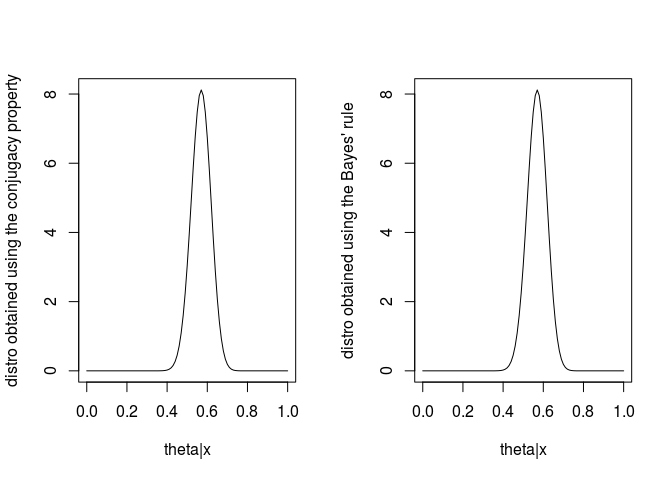<!-- -->
for a general Beta(a,b) we can have different behaviors

```r
# all plots rescaled
par(mfrow=c(2,2))
a = 0.1
b = 0.1
curve(dbeta(x, a, b)/dbeta(0.3,a,b),ylab ="",col="green",type="p",ylim = c(0,1))
#curve(dbeta(x, a+Y, b+n-Y),col="green",type="o")
curve(dbinom(Y,n,x)/max(dbinom(Y,n,x)),add=T,col="red",type="p")
curve(posterior_curve(x,a,b,Y,n,0,1)/posterior_curve(0.5,a,b,Y,n,0,1), add=T,col="blue")
title("a=0.1,b=0.1")
legend('topleft',c("likelihood","prior","posterior"),lty=c(1,1),lwd=c(2.5,2.5),col=c("red","green","blue"))
#curve(dbeta(x,a+Y,b+n-Y),add=T,col="red",type="o")
grid()
a = 1
b = 1
curve(dbeta(x, a, b)/max(dbeta(x,a,b)),ylab ="",col="green",type="p",ylim = c(0,1))
#curve(dbeta(x, a+Y, b+n-Y),col="green",type="o")
curve(dbinom(Y,n,x)/max(dbinom(Y,n,x)),add=T,col="red",type="p")
curve(posterior_curve(x,a,b,Y,n,0,1)/max(posterior_curve(x,a,b,Y,n,0,1)), add=T,col="blue")
title("a=1,b=1")
legend('topleft',c("likelihood","prior","posterior"),lty=c(1,1),lwd=c(2.5,2.5),col=c("red","green","blue"))

#curve(dbeta(x,a+Y,b+n-Y), add=T, type="o")
grid()
a = 5
b = 5
curve(dbeta(x, a, b)/max(dbeta(x,a,b)),ylab ="",col="green",type="p",ylim = c(0,1))
#curve(dbeta(x, a+Y, b+n-Y),col="green",type="o")
curve(dbinom(Y,n,x)/max(dbinom(Y,n,x)),add=T,col="red",type="p")
curve(posterior_curve(x,a,b,Y,n,0,1)/max(posterior_curve(x,a,b,Y,n,0,1)), add=T,col="blue")
title("a=5,b=5")
legend('topleft',c("likelihood","prior","posterior"),lty=c(1,1),lwd=c(2.5,2.5),col=c("red","green","blue"))

#curve(dbeta(x,a+Y,b+n-Y), add=T, type="o")
grid()
a = 10
b = 10
curve(dbeta(x, a, b)/max(dbeta(x,a,b)),ylab ="",col="green",type="p",ylim = c(0,1))
#curve(dbeta(x, a+Y, b+n-Y),col="green",type="o")
curve(dbinom(Y,n,x)/max(dbinom(Y,n,x)),add=T,col="red",type="p")
curve(posterior_curve(x,a,b,Y,n,0,1)/max(posterior_curve(x,a,b,Y,n,0,1)), add=T,col="blue")
title("a=10,b=10")
legend('topleft',c("likelihood","prior","posterior"),lty=c(1,1),lwd=c(2.5,2.5),col=c("red","green","blue"))

#curve(dbeta(x,a+Y,b+n-Y), add=T, type="o")
grid()
```

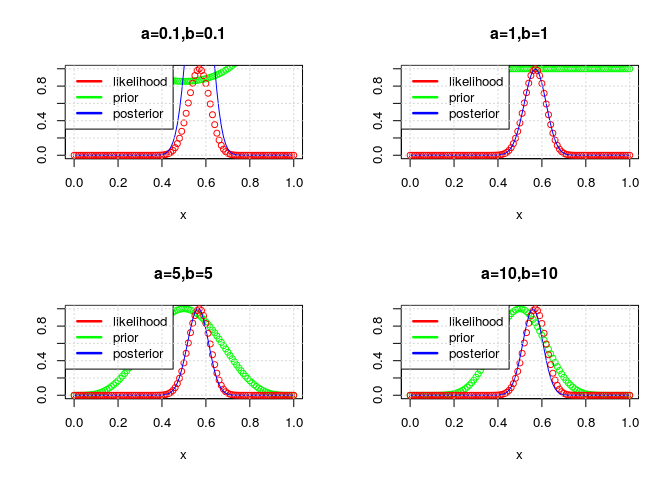<!-- -->


2) Consider a normal statistical model with $X_i \sim N(\theta,\lambda=1/\sigma^2)$ where the precision parameter is known. 
Use as a prior distribution on the (conditional) mean $\theta$ a Normal with prior mean $\mu$ and prior precision $\nu$. 

a) derive the general formula of the prior predictive distribution 

$$m(x) = \int_{\Theta} J(x,\theta) d\theta = \int_{\Theta} f(x|\theta) \pi(\theta) d \theta$$
$$ X_i|\theta \sim N(\theta,\lambda)$$
$$ \theta \sim N(\mu,\nu)$$

$$m(x) = \int_{\Theta}\sqrt\frac{\lambda}{2\pi} e^{-\frac{\lambda(x-\theta)^2}{2}}
\sqrt\frac{\nu}{2\pi} e^{-\frac{\nu(\theta-\mu)^2}{2}} d\theta = \frac{\sqrt{\lambda\nu}}{2\pi}e^{-\frac{\lambda x^2+\mu^2\nu}{2}} \int_{\Theta}  e^{-\frac{(\lambda+\nu)\theta^2 -2(\lambda x+\mu\nu)\theta}{2}} d\theta$$

$$ a = \lambda + \nu$$
$$ b = \lambda x+\mu\nu$$
$$e^{-\frac{a\theta^2 -2b\theta}{2}} \propto N(\frac{b}{a},a)$$
$$\int_{\Theta} N(\frac{b}{a},a) = 1$$
\[\int_{\Theta} e^{-\frac{(\lambda+\nu)\theta^2 -2(\lambda x+\mu\nu)\theta}{2}} d\theta =\frac{\sqrt{2\pi}}{\sqrt{a}} e^{\frac{b^2}{a}}\]
$$m(x) = \frac{\sqrt{\lambda\nu}}{2\pi}e^{-\frac{\lambda x^2+\mu^2\nu}{2}} \frac{\sqrt{2\pi}}{\sqrt{a}} e^{\frac{b^2}{a}} = \frac{1}{\sqrt{2\pi}} \frac{\sqrt{\lambda\nu}}{\sqrt{\lambda+\nu}}e^{-\frac{1}{2}\frac{\lambda\nu}{\lambda+\nu} (x-\mu)^2}$$
$$ m(x) \sim N(\mu,\frac{\lambda\nu}{\lambda+\nu})$$


b) derive the general formula of the posterior predictive distribution 

In this particular case we know that the posterior distribution of $\theta$, for the theory of normal conjugacy, is a normal with hyper-parameters updated
$$ \theta_{prior} \sim N(\mu,\nu)$$
$$ X|\theta \sim N(\theta,\lambda)$$
$$ \theta_{posterior} \sim N(\mu_{*},\nu_{*})$$

and we can write for the predictive posterior

$$\pi(x^{new}|x) = \int_{\Theta} f(x^{new}|\theta)\pi(\theta|x) d \theta$$

now, because we have again two Normal distributions, the posterior predictive can be obtained in the same way of the prior and it will be a normal with appropriate parameters.

$$X^{new}|\theta \sim N(\theta,\lambda) $$
$$\theta|X \sim N(\mu_{*},\nu_{*})$$

$$X^{new}|X \sim N(\mu_{*},\frac{\lambda\nu_{*}}{\lambda+\nu_{*}})$$

to explicit this distribution we need obviously to compute the posterior parameter for $\theta_{posterior}$: but now this is not difficult because, having a Normal likelihood
and a Normal prior the posterior(for $\theta$) will be a Normal. In fact

$$\pi(\theta|x) = \frac{f(x|\theta)\pi(\theta)}{\int_{\Theta} f(x|\theta)\pi(\theta) d \theta}$$

considering a sample conditionally iid and that the denominator is a constant respect
to $\theta$
\[\pi(\theta|x) \propto \left( \prod_{i=1}^n \frac{\sqrt{\lambda}}{\sqrt{2\pi}}e^{-\frac{\lambda (x_i -\theta)^2}{2}} \right) \frac{\sqrt{\nu}}{\sqrt{2\pi}}e^{-\frac{\nu (\theta-\mu)^2}{2}}
\propto exp\left\{-\frac{[\theta^2(\lambda n+\nu)-2 \theta (\lambda n \bar{x}_n+\mu\nu)]}{2}\right\}\]

and using the same property as before we can state that

$$\mu_{*} = \frac{\lambda n \bar{x}_n+\mu\nu}{\lambda n+\nu}$$
$$\nu_{*} = \lambda n+\nu$$
and now we know all about the distribution of $X_{new}|X$.

c) assume that the known value of $\lambda$ is $1/3$ and suppose you have observed the following data 
$$
-1.25 \,\,\,
8.77 \,\,\,
1.18 \,\,\,
10.66  \,\,\,
11.81  \,\,\,
-6.09   \,\,\,
3.56  \,\,\,
10.85   \,\,\,
4.03   \,\,\,
2.13 \,\,\,
$$
Elicit your prior distribution on the unknown $\theta$ in such a way that your prior mean is 0 and you believe that the unknown theta is in the interval $[-5,5]$ with prior probability 0.96

Choosing a normal for $\theta$ we can use the quantile of a standard normal at 0.96 and it is natural to consider the symmetry of the distribution to compute an interval and derive the variance.

In general, if $\alpha = 1-0.96$, we want this condition

$$P\left(|\frac{x-\mu}{\sigma}| \ge |\frac{5-\mu}{\sigma}| \right) \le \alpha$$
$$ \mu = 0$$

$$\frac{5}{\sigma} = qnorm(1-\frac{\alpha}{2})$$
$$ \sigma = 5/qnorm(1-\frac{\alpha}{2})$$

In formula


```r
alpha = 1-0.96
q = qnorm(1-alpha/2)
mu = 0
sdev = 5/q
nu = 1/(sdev^2)  # prior precision
curve(dnorm(x,mu,sdev),-10,10, xlab = "x|theta")
```

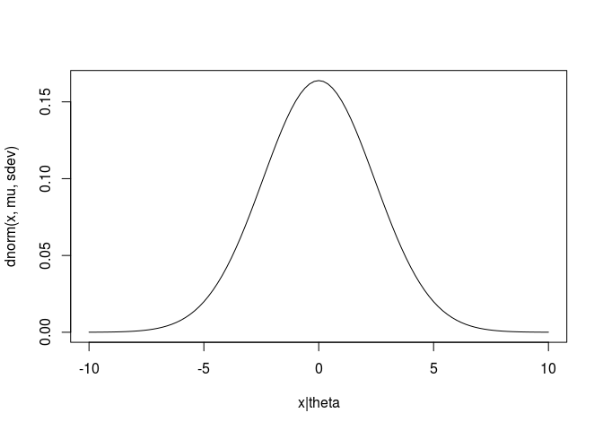<!-- -->

```r
# check
N = 10000
res = rnorm(N,mu,sdev)
up = sum((res >= 5)*1)
down = sum((res <= -5)*1)
s = up+down
s/length(res)*100
```

```
## [1] 4.22
```

d) derive your posterior distribution and represent it graphically 

we know, from the conjugate analysis for Normal data, that using a Normal as prior we obtain a posterior that is again a Normal but with new parameters. Doing the same computation as before we can state that: 
$$\theta \sim N(\mu,\nu)$$
$$X|\theta \sim N(\theta,\lambda)$$

$$\theta|X \sim N(\mu_{x},\nu_{x})$$

$$\mu_{x} = w \mu + (1-w) \bar{x}_n$$
$$\nu_{x} = \nu + n\lambda$$

$$w = \frac{\nu}{\nu+n\lambda}$$

we can see that these new parameters contain information from the data (sample size and empirical mean) and from the prior model; there is also a weight that gives more or less importance to one of the two function: in general bigger is the sample size, bigger is the likelihood contribution.

```r
data = c(-1.25, 8.77, 1.18, 10.66, 11.81, -6.09, 3.56, 10.85, 4.03, 2.13)
lambda = 1/3

# one way
prior = function(x){
    return(dnorm(x,mean=mu,sd = sdev ))
}

like = function(x,data,lambda){
    n = length(data)
    res = ((lambda/(2*pi))^(n/2)) * exp(-lambda*sum((data-x)^2)/2)
    return(res)
}

x = seq(0,10,0.1)
y = rep(0,length(x))
for (i in 1:length(x)){
    y[i] = like(x[i],data,lambda)
}
#check
#plot(x,y,col="blue")
#abline(v=mean(data),col="red")

#better way
likelihood_point = function(theta){
  lik = prod(dnorm(data,mean=theta,sd=1/sqrt(lambda)))
  return(lik)
}
# vectorizing
likelihood = Vectorize(likelihood_point)
curve(likelihood(x),from=-10,to=10,xlab=expression(theta), main="Likelihood function",ylab=expression(L(theta)),col = "red")
abline(v=mean(data),col="green")
```

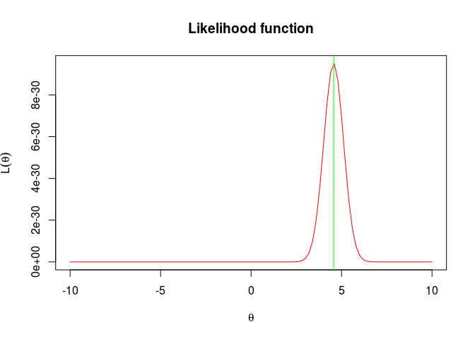<!-- -->

```r
posterior = function(x){
    
    den = integrate(function(x) likelihood(x)*prior(x),-10,10)[1]$value
    res = (likelihood(x)*prior(x))/den
    return(res)
}

#comparison

mu_p = integrate(function(x) x*posterior(x),-Inf,Inf)[1]$value

curve(prior(x)/prior(mu),-10,10,col="green",ylab="",xlab = expression(theta))
curve(likelihood(x)/likelihood(mean(data)),-10,10,add=T,col="red")
curve(posterior(x)/posterior(mu_p),-10,10,add=T,col="blue")
legend('topleft',c("likelihood","prior","posterior"),lty=c(1,1),lwd=c(2.5,2.5),col=c("red","green","blue"))
title("rescaled distributions with normal model")
```

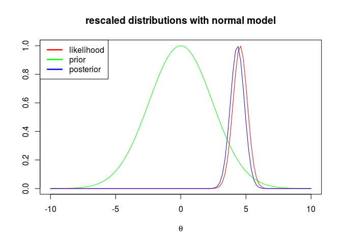<!-- -->

```r
n = length(data)
nu = 1/sdev^2

w = nu/(nu+n*lambda)
mu_post = w*mu+(1-w)*mean(data)
prec_post = nu+n*lambda
#check
curve(posterior(x),0,10,col="blue",ylab = expression(posterior(theta)),xlab = expression(theta))
curve(dnorm(x,mu_post,1/sqrt(prec_post)),add=TRUE, type="o",col="orchid")
title("check posterior")
```

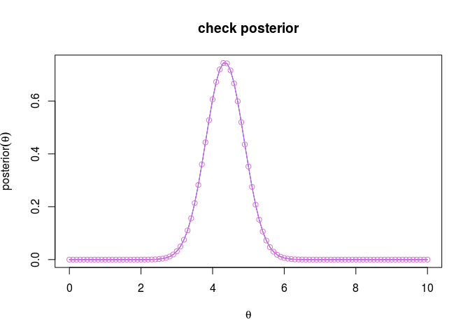<!-- -->

e) derive your favorite point estimate and interval estimate and motivate your choices

In this case, because the posterior distribution is Normal, we can use the posterior mean(that it is also the MLE, the mode and the median) to evaluate our distribution; and as credibility interval it is natural to use a Normal interval because all is symmetric and we know the posterior precision. 
In particular the posterior Bayesian estimator for the mean is 

$$\int_{\Theta} \theta N(\mu_{x},\nu_{x}) d \theta = \mu_{x} $$

$$\mu_{x} = w \mu + (1-w) \bar{x}_n$$

```r
alpha = 0.04
bayesian_estimator = mu_post

#check
cat("posterior bayesian estimator: ",integrate(function(x) x*posterior(x),-Inf,Inf)[1]$value)
```

```
## posterior bayesian estimator:  4.344909
```

```r
q = qnorm(1-alpha/2)
up = mu_post + q*(1/sqrt(prec_post))
down = mu_post -q*(1/sqrt(prec_post))
cat("credibility interval: ", down, up)
```

```
## credibility interval:  3.247622 5.442529
```

```r
curve(posterior(x),-10,10,col="red", xlab = "theta|x", ylab = "posterior")
title("point and interval estimation")
abline(v = c(down,bayesian_estimator,up),col="blue")
print(c(down,bayesian_estimator,up))
```

```
## [1] 3.247622 4.345076 5.442529
```

```r
grid()
```

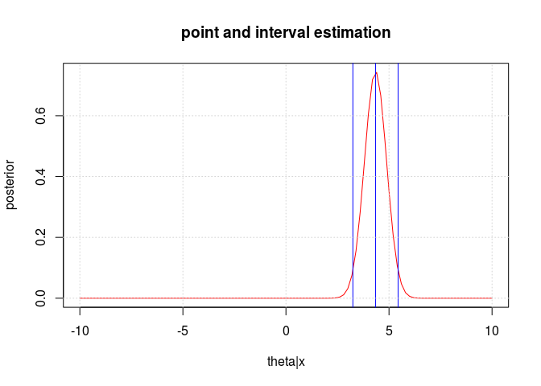<!-- -->

```r
#check
integrate(function(x) posterior(x),down,up)
```

```
## 0.9599631 with absolute error < 3.8e-11
```

3) As an alternative model for the previous 10 observations 
$$
-1.25 \,\,\,
8.77 \,\,\,
1.18 \,\,\,
10.66  \,\,\,
11.81  \,\,\,
-6.09   \,\,\,
3.56  \,\,\,
10.85   \,\,\,
4.03   \,\,\,
2.13 \,\,\,
$$
consider the following statistical model where $X_i|\theta$ are i.i.d with 
$$
X_i|\theta \sim f(x|\theta) = \frac{1}{20} I_{[\theta-10,\theta+10](x)}
$$
Use the same prior elicitation for $\theta$ as in the model of the previous exercise 

a) Provide a fully Bayesian analysis for these data explaining all the basic ingredients and steps for carrying it out. In particular,  compare your final inference on the unknown $\theta=E[X|\theta]$ with the one you have derived in the previous point 2) 

As before we can derive a posterior distribution for $\theta$ using a statistical model for the data (a Uniform model in this case) and a prior distribution for the random variable associated with the parameter space(Normal as before).
$$\pi(\theta|x) = \frac{f(x|\theta)\pi(\theta)}{\int_{\Theta} f(x|\theta)\pi(\theta) d \theta}$$
where
$$X_i|\theta \sim Unif(\theta-10,\theta+10)$$
$$\theta \sim N(\mu,\nu)$$

computing the likelihood we should consider that, given the data, $\theta$ is the only source of randomness and we can write

$$L_{x}(\theta) = \frac{1}{20^n}\prod_{i=1}^n I_{[\theta-10,\theta+10]}(x_{i})$$

where this product is different from zero only if
$$\theta-10 \le x_{min}.....,x_{max} \le \theta+10$$

so $\theta \in \{ x_{max}-10, x_{min}+10 \}$ and the posterior is bounded into these values.

```r
likelihood_point_new = function(theta){
    
    lik=prod(dunif(data,min=theta-10,max=theta+10))
  return(lik)
}

theta = seq(-5,5,0.1)
L = rep(0,length(theta))
for (i in 1:length(theta)){
    
    L[i] = likelihood_point_new(theta[i])
}
#plot(theta,L)
#grid()
likelihood_new = Vectorize(likelihood_point_new)
curve(likelihood_new(x),-10,10,ylab= expression(L(theta)),xlab = expression(theta))
grid()
```

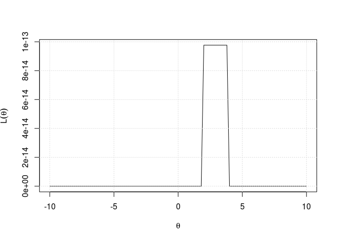<!-- -->

```r
posterior_new = function(x){
    
    den = integrate(function(x) (prior(x)*likelihood_new(x)),-Inf,Inf)[1]$value
    res = (prior(x)*likelihood_new(x))/den
    return(res)
}
curve(likelihood_new(x)/likelihood_new(3),-10,10,col="red",lwd=2,ylab="",
      xlab=expression(theta))  # rescaled likelihood
curve(prior(x)/prior(mu),-10,10,add=T,col="green",lwd=2)  # rescaled prior
curve(posterior_new(x)/max(posterior_new(x)),-10,10,col="blue",add=T,lwd=4) #
legend('topleft',c("likelihood","prior","posterior"),lty=c(1,1),lwd=c(2.5,2.5),
       col=c("red","green","blue"))
title("rescaled distributions")
```

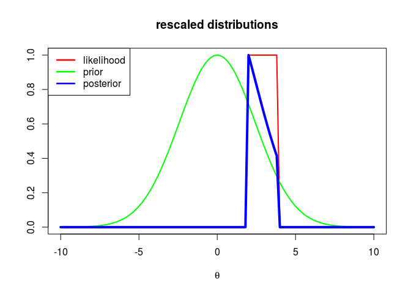<!-- -->

```r
#check posterior
integrate((function(x)posterior_new((x))),-Inf,Inf)
```

```
## 1.025401 with absolute error < 7.4e-05
```

```r
# posterior bayesian estimator
mu_post_new = integrate((function(x) x*posterior_new((x))),-Inf,Inf)[1]$value

cat("posterior mean: ", mu_post_new)
```

```
## posterior mean:  2.758036
```

```r
# credibility interval computed numerically
levels = seq(0,5,0.01)
cdf = rep(0,length(levels))

for(i in 1:length(levels)){
    cdf[i] = integrate((function(x) posterior_new((x))),0,levels[i])[1]$value
}

# I want to build a 0.96 confidence interval but considering that 
#this distribution is not simmetric and with a lot of mass on the left.

for(i in 1:length(cdf)){
    if (cdf[i] > 0){
        down.new = levels[i]
        break
    }
}
for(i in 1:length(cdf)){
    if (cdf[i] > 0.96){
        up.new = levels[i]
        break
    }
}

cat("credibility interval at level 0.96: ", c(down.new, mu_post_new ,up.new) )
```

```
## credibility interval at level 0.96:  1.82 2.758036 3.69
```

```r
curve(posterior_new(x),-10,10, xlab=expression(theta),ylab =expression(posterior(theta)),
      col = "blue")
abline(v = c(down.new,mu_post_new,up.new),col="orchid")
```

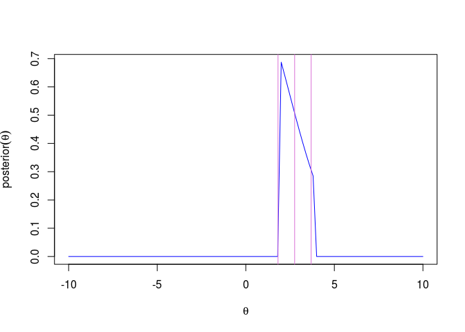<!-- -->

```r
#check
integrate(function(x) posterior_new(x),down.new,up.new)
```

```
## 0.9553735 with absolute error < 1.1e-14
```
we can compare the results for the two different statistical model

```r
curve(prior(x)/prior(mu),-10,10,col="green",ylab="",xlab = expression(theta))
curve(likelihood(x)/likelihood(mean(data)),-10,10,add=T,col="red",lty=2)
curve(posterior(x)/posterior(mu_p),-10,10,add=T,col="blue",lwd=2)
title("normal model vs uniform model")
curve(likelihood_new(x)/likelihood_new(3),-10,10,add=T,col="red",lty=2)
curve(posterior_new(x)/max(posterior_new(x)),-10,10,col="blue",add=T,lwd=2)
legend('topleft',c("likelihood","prior","posterior"),lty=c(1,1),lwd=c(2.5,2.5),
       col=c("red","green","blue"))
```

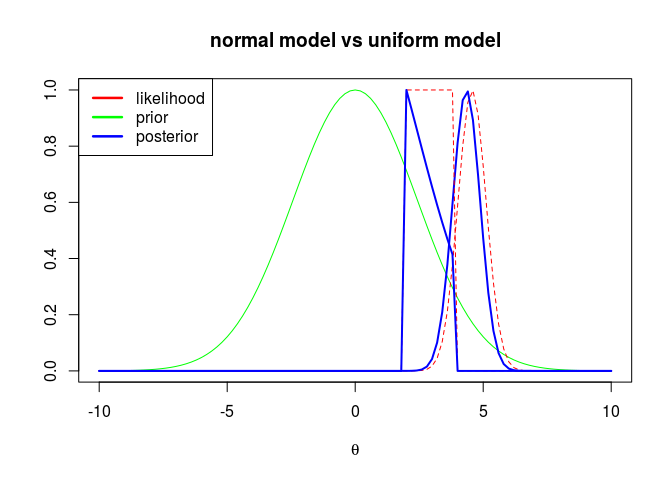<!-- -->
It is possible to observe that, in the Normal model, the empirical evidence is dominant (and unbalanced); instead in the Uniform model the prior influence is substantial and it gives a smaller weight to the data.


b) Write the formula of the prior predictive distribution of a single observation and explain how you can simulate i.i.d random draws from it. Use the simulated values to represent approximately the predictive density in a plot and compare it with the prior predictive density of a single observation  of the previous model

for a single observation we can write:

$$m(x) = \int_{\Theta} f(x|\theta)\pi(\theta)$$
$$m(x) = \frac{1}{20}\int_{\Theta}I_{[\theta-10,\theta+10]}(x) N(\theta,\mu,\nu) d\theta$$

but the indicator function is different from zero only if x is in the interval; so we can rewrite

$$m(x) = \frac{1}{20}\int_{x-10}^{x+10}N(\theta,\mu,\nu) d\theta = \frac{1}{20}(\Phi(x+10)-\Phi(x-10))$$

.

```r
prior_predictive = function(x){
    
    res = (1/20)*(pnorm(x+10,mean=mu,sd=1/sqrt(nu))-pnorm(x-10,mean=mu,sd=1/sqrt(nu)))
    return(res)

}
curve(prior_predictive(x),-20,20,col="blue",lwd=2, ylab = "prior predictive")
```

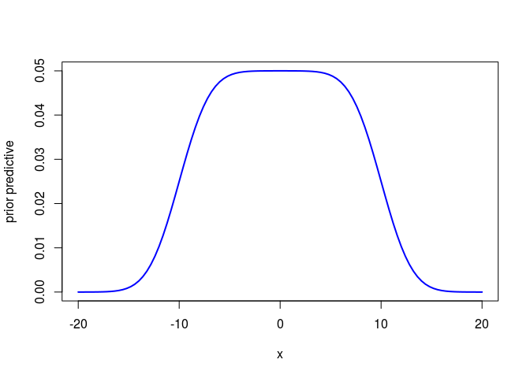<!-- -->

```r
integrate((function(x)prior_predictive((x))),-Inf,Inf)
```

```
## 1 with absolute error < 9.3e-07
```
now we can use the conditional distribution and the prior for $\theta$ to compute an approximation of this distribution: in fact sampling from the distribution of $\theta$ we can fix this value to obtain the conditional distribution $X|\theta$ and now sampling from this distribution we obtain a sample from the prior predictive: repeating this process $N$ times we obtain an approximation of the prior predictive distribution.

```r
n = 1000
marg = rep(0,n)
for(i in 1:n){
    theta = rnorm(1,mu,1/sqrt(nu))
    marg[i] = runif(1,min = theta-10,max = theta+10)
}

hist(marg,freq=F,col = "yellow",breaks = 20,ylab = "prior predictive approximation",xlab = "x",main = paste("prior predictive"))
curve(prior_predictive(x),-20,20,col="blue",lwd=2,add=T)
```

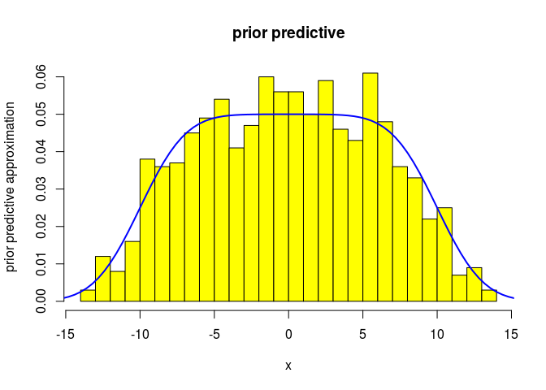<!-- -->

```r
p = (lambda*nu)/(lambda+nu)
curve(dnorm(x,mu,1/sqrt(p)),-20,20,lwd=2, ylab = "prior predictive")
curve(prior_predictive(x),-20,20,col="blue",lwd=2,add=T)
legend('topleft',c("prior predictive normal model","prior predictive uniform model"),lty=c(1,1),lwd=c(2.5,2.5),col=c("black","blue"))
```

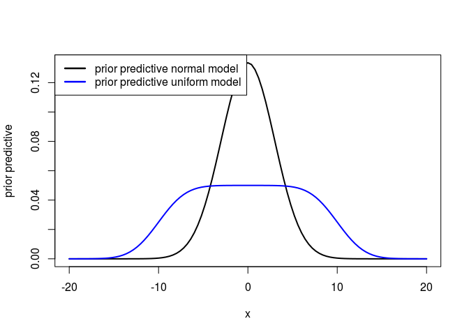<!-- -->
comparing these two priors it is clear that the second model is less confident on the values of the random variable.

c) Consider the same discrete (finite) grid of values as parameter space $\Theta$ for the conditional mean $\theta$ in both models. Use this simplified parametric setting to decide whether one should use the Normal model rather than the Uniform model in light of the observed data. 

To evaluate two model we can use the **Bayes factor** that is, in some sense, the ratio between the posterior distributions of the two models; in general:

$$J(x,m,\theta) = J(x|\theta,m)J(\theta,m) = J(x|\theta,m)J(\theta|m)J(m)$$
$$J(x,m) = \int_{\Theta} J(x|\theta,m)J(\theta|m)J(m) d\theta$$

$$J(m|x) = \dfrac{J(x,m)}{J(x)} = \dfrac{\int_{\Theta} J(x|\theta,m)J(\theta|m)J(m) d\theta}{\int_m\int_{\Theta} J(x|\theta,m)J(\theta|m)J(m) d\theta dm}$$
where

$$m \sim Bern(p)$$
$$\theta|m \sim 1/|\Theta|\, I_{\Theta} \quad\quad \Theta \subseteq \mathbb{Z}$$
$$X_i|\theta,m_1 \sim N(\theta,\lambda)$$
$$X_i|\theta,m_2 \sim \frac{1}{20} I_{[\theta-10,\theta+10]}$$
in this case, where all the $\theta_k|m_j$ are discrete uniform and the models are in finite number $m_j$ where $j=2$ we can rewrite

$$J(m_j|x)  = \dfrac{\sum_{k=1}^{\Theta} J(x|\theta_k,m_j)J(\theta_k|m_j)J(m_j)} {\sum_{j=1}^2\sum_{k=1}^{\Theta} J(x|\theta_k,m_j)J(\theta_k|m_j)J(m_j)}$$


```r
theta = seq(-10,10,0.1)
m = c(1,2)
J_m = c(0.5,0.5) # prior distribution for the models
J_theta_m = 1/length(theta) #  parameter distribution for the models

J_x_theta_m1 = likelihood(theta)
J_x_theta_m2 = likelihood_new(theta)


den = sum(J_x_theta_m1*J_theta_m*J_m[1]) + sum(J_x_theta_m2*J_theta_m*J_m[2])
J_m1_x = sum(J_x_theta_m1*J_theta_m*J_m[1])/den
J_m2_x = sum(J_x_theta_m2*J_theta_m*J_m[2])/den


cat("ratio posterior distribution Uniform/Normal model: ", J_m2_x/J_m1_x)   
```

```
## ratio posterior distribution Uniform/Normal model:  1.568766e+16
```

```r
# model 2 extremely better than model 1 using a Bayesian approach
```
this analysis shows that the second model is extremely better in a Bayesian sense respect to the Normal model: this is clear when we think that the Normal model gives a lot of importance to the sample data also if the sample is extremely small and the sampling distribution has nothing in common with a Normal; instead with a small sample a Uniform distribution is a better choice considering the posterior distribution of the models. 


```r
par(mfrow=c(1,3))
plot(theta,likelihood(theta),col="blue",ylab = "Normal Model", xlab = "x|theta,m1")
title("discrete Normal model")
plot(theta,likelihood_new(theta),col="blue",ylab = "Uniform Model", xlab = "x|theta,m2")
title("discrete Uniform model")
plot(theta,rep(J_theta_m,length(theta)),ylab = "prior", xlab = "theta|m")
title("distribution theta both models")
```

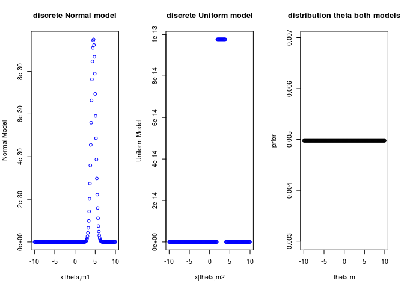<!-- -->

```r
par(mfrow=c(1,2))
plot(m,J_m,ylab = "prior distribution of m",col="green")
title("prior")
plot(m,c(J_m1_x,J_m2_x),ylab = "posterior distribution of m", col="blue")
title("posterior")
```

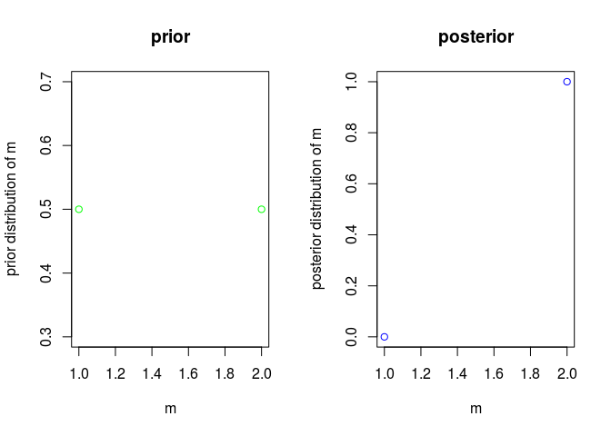<!-- -->
it is interesting to see that if we change our prior choice, for example giving a lot of importance to the Normal model, we obtain again that the Uniform model is the best choice.

```r
theta = seq(-10,10,0.1)
m = c(1,2)
J_m = c(0.99,0.01) # prior distribution for the models
J_theta_m = 1/length(theta) #  parameter distribution for the models

J_x_theta_m1 = likelihood(theta)
J_x_theta_m2 = likelihood_new(theta)


den = sum(J_x_theta_m1*J_theta_m*J_m[1]) + sum(J_x_theta_m2*J_theta_m*J_m[2])
J_m1_x = sum(J_x_theta_m1*J_theta_m*J_m[1])/den
J_m2_x = sum(J_x_theta_m2*J_theta_m*J_m[2])/den


J_m2_x/J_m1_x   # model 2 extremely better than model 1                  # in a Bayesian approach
```

```
## [1] 1.584612e+14
```
if we want to use the Normal model for the prior of $\theta$ instead of a discrete model


```r
m = c(1,2)
J_m = c(0.5,0.5) # prior distribution for the models


den = integrate((function(x) likelihood(x)*prior(x)*J_m[1]),-Inf,Inf)[1]$value + integrate(function(x) likelihood_new(x)*prior(x)*J_m[1],-Inf,Inf)[1]$value
J_m1_x = integrate((function(x) likelihood(x)*prior(x)*J_m[1]),-Inf,Inf)[1]$value 
J_m2_x = integrate((function(x) likelihood_new(x)*prior(x)*J_m[1]),-Inf,Inf)[1]$value


J_m2_x/J_m1_x   # model 2 extremely better than model 1  
```

```
## [1] 4.623562e+16
```


* * *
