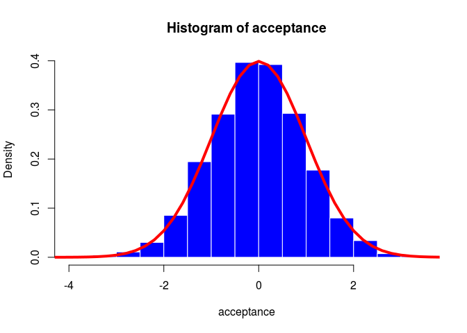
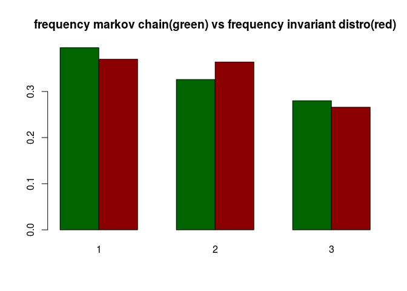
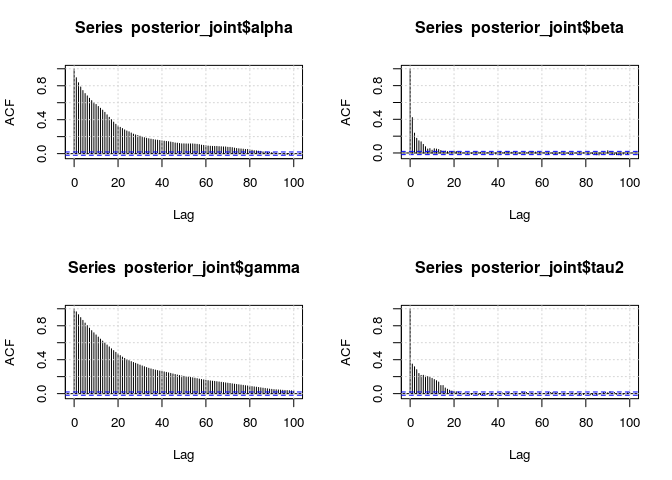
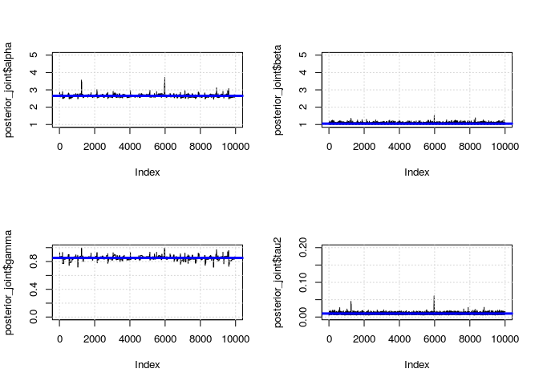
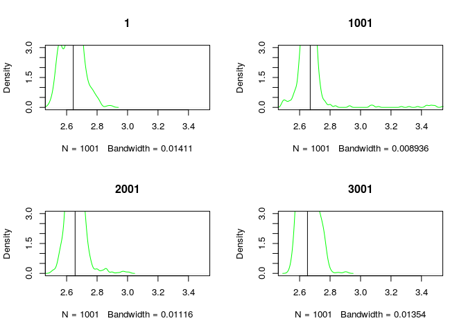
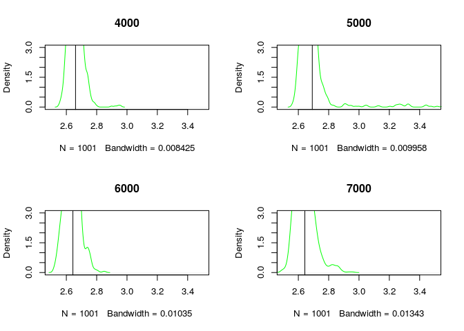
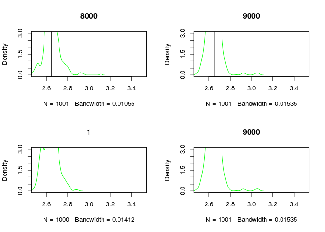
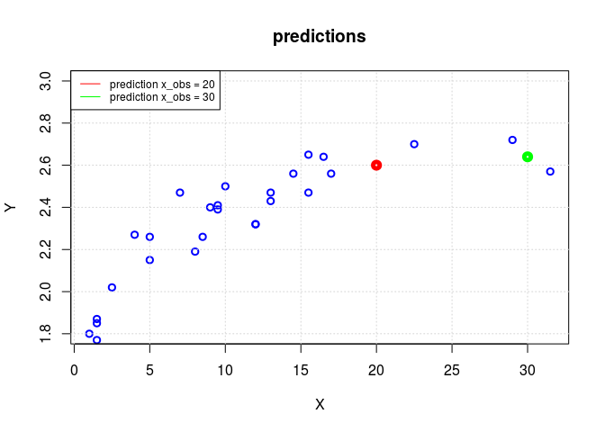
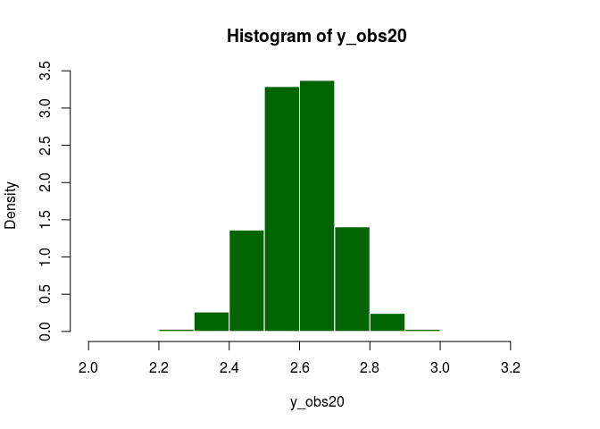
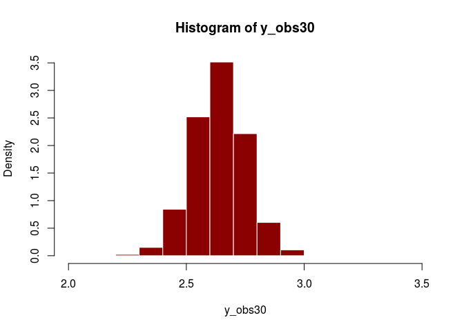

# MCMC
| georgos
  


1a)  Illustrate the characteristics of the statistical model for dealing with the *Dugong*'s data. Lengths ($Y_i$)  and  ages ($x_i$) of  27 Dugongs have been recorded and the
  following (non linear)  regression model is considered:
\begin{eqnarray*}
Y_i &\sim& N(\mu_i, \tau^2) \\
\mu_i=f(x_i)&=& \alpha - \beta \gamma^{x_i}\\
\end{eqnarray*}
Model parameters are
$\alpha \in (1, \infty)$,
$\beta \in (1, \infty)$,
$\gamma \in (0,1)$,
$\tau^2 \in (0,\infty)$. 
Let us consider the following prior distributions:
\begin{eqnarray*}
\alpha &\sim&  N(0,\sigma^2_{\alpha})\\
\beta  &\sim&  N(0,\sigma^2_{\beta}) \\
\gamma &\sim&  Unif(0,1)\\
\tau^2 &\sim&  IG(a,b)) (Inverse Gamma)
\end{eqnarray*}

The Dugongs data model is a hierarchical non-linear Bayesian model. The model assumes priors distribution for the parameters alpha, beta, gamma and tau2. The first three parameters are part of a non linear function of the data(the Dugongs' age) to build the mean of the target distribution. The target distribution is the distribution of the Dugongs' height: fixed alpha, beta and gamma, this distribution is a Normal centered in mu and with tau2 as variance. The underline joint for the parameters is a four dimensional distribution and we want to apply the Bayesian inference to analyze this model and to make predictions.


1b)  Derive the corresponding likelihood function

In this case, fixed the parameters, $Y_i|\tau^2,\mu_i \sim N(\mu_i, \tau^2)$; so to obtain the corresponding likelihood function we have to compute $L(\theta) = f(y_1,....,y_n|\mu,\tau^2)$; and because the observations are conditionally independent and identically distributed we can write
\[
L(\theta) = \prod_{i=1}^n f(y_i|\mu_i,\tau^2) = \frac{\tau^{-n}}{(2\pi)^{n/2}}  \exp\{ -\frac{1}{2}\sum_{i=1}^n (y_i - \mu_i)^2 \tau^{-2} \}
\]
where $\mu_i = \alpha - \beta \gamma^{x_i}$.
The likelihood is a function of $\alpha,\beta,\gamma,\tau^2$.


1c)  Write down the expression of the joint prior distribution of the parameters at stake and illustrate your suitable choice for the hyper-parameters.

The joint prior is $\pi(\alpha,\beta,\gamma,\tau^2)$ and because the parameters are reciprocally independents we can write
$\pi(\alpha)\pi(\beta)\pi(\gamma)\pi(\tau^2)$ and finally
\[
\pi(\theta) = \frac{1}{\sqrt{2\pi \sigma_{\alpha}^2}}\exp\{-\frac{1}{2}(\alpha^2\sigma_{\alpha}^{-2})\}  \frac{1}{\sqrt{2\pi \sigma_{\beta}^2}}\exp\{-\frac{1}{2}(\beta^2\sigma_{\beta}^{-2})\} I_{[0,1]} 
\frac{b^a}{\Gamma(a)} \tau_2^{(-a-1)} \exp(-\frac{b}{\tau^2})
\]


```r
require(invgamma)
```

```
## Loading required package: invgamma
```

```r
dugong = read.table("dugong-data.txt",header = TRUE)
X = dugong$Age
Y = dugong$Length
summary(X)
```

```
##    Min. 1st Qu.  Median    Mean 3rd Qu.    Max. 
##    1.00    5.00    9.50   10.94   15.00   31.50
```

```r
summary(Y)
```

```
##    Min. 1st Qu.  Median    Mean 3rd Qu.    Max. 
##   1.770   2.225   2.400   2.334   2.530   2.720
```

```r
plot(X, Y, xlab = "Age", ylab = "Length", col = "blue", main = "dugong's data", lwd = 3)
grid()
```

<!-- -->

```r
mean_y = mean(Y)
var_y = var(Y)

###############################################################################
## create useful functions
par(mfrow=c(2,2))
#alpha
dAlpha = function(x, sigma_alpha){
    
    res = dnorm(x, mean = 0, sd = sqrt(sigma_alpha)) * (x > 1)
    return (res)
}
dAlpha_normalized = function(x, sigma_alpha){
    
    den = integrate(function(x) dAlpha(x,sigma_alpha),
                    lower = -Inf, upper =  +Inf)[[1]]
    
    return (dAlpha(x,sigma_alpha)/den)
}
curve( dAlpha_normalized(x, 2) ,0,10, xlab = "alpha", ylab = "p(alpha)", col = "blue", lwd = 3)
grid()
integrate(function(x) dAlpha_normalized(x,2),lower = -Inf, upper =  +Inf)
```

```
## 1 with absolute error < 4.2e-07
```

```r
#beta
dBeta = function(x, sigma_beta){
    
    res = dnorm(x, mean = 0, sd = sqrt(sigma_beta)) * (x > 1)
    
    return (res)
}
dBeta_normalized = function(x, sigma_beta){
    
    den = integrate(function(x) dBeta(x,sigma_beta),
                    lower = -Inf, upper =  +Inf)[[1]]
    
    return (dBeta(x,sigma_beta)/den)
}
curve( dBeta_normalized(x, 2) ,0,10, xlab = "beta", ylab = "p(beta)", col = "darkgreen", lwd = 3)
grid()
integrate(function(x) dBeta_normalized(x,2),lower = -Inf, upper =  +Inf)
```

```
## 1 with absolute error < 4.2e-07
```

```r
#gamma
dGamma = function(x, min = 0, max = 1){
    
    res = dunif(x, min = min, max = max)
    return (res)
}
curve( dGamma(x) ,-1,2, xlab = "gamma", ylab = "p(gamma)", col = "yellow", lwd = 3)
grid()
integrate(function(x) dGamma(x),lower = -Inf, upper =  +Inf)
```

```
## 1 with absolute error < 4.2e-11
```

```r
#tau
dTau2 = function(x, a, b){
    
    res = dinvgamma(x, a, b) * (x > 0)
    return(res)
}
curve( dTau2(x,2,2) ,0,10, xlab = "tau2", ylab = "p(tau2)", col = "red", lwd = 3)
grid()
```

<!-- -->

```r
integrate(function(x) dTau2(x,1,1),lower = 0, upper =  +Inf)
```

```
## 1 with absolute error < 5.7e-05
```

```r
#sample
rAlpha = function(n, sigma_alpha){
    
    res = rnorm(n, mean = 0, sd = sqrt(sigma_alpha))
    res = res[res > 1]
    
    return (res)
}
rBeta = function(n, sigma_beta){
    
    res = rnorm(n, mean = 0, sd = sqrt(sigma_beta))
    res = res[res > 1]
    
    return (res)
}
rGamma = function(n, min = 0, max = 1){
    
    res = runif(n, min = min, max = max)
    return (res[res < 1 && res > 0])
}
rTau2 = function(n, a, b){
    
    res = rinvgamma(n, a, b)
    res = res[res >0]
    return(res)
}

#use this function to choose the hyperparameters
mu = function(X, alpha, beta, gamma){
    res = ( alpha - beta * gamma^(mean(X)))
    return (res)
    
}

# use this function after the fix of the hyperparameters 
mu_opt = function(X, alpha, beta, gamma){
    
    s = min(length(alpha), length(beta), length(gamma))
        
    alpha = alpha[1:s]
    beta  = beta[1:s]
    gamma = gamma[1:s]
    
    res = ( alpha - beta * gamma^(X) )
    res = res[res > 0]
    return (res)
    
}


# why do we normalize?
par(mfrow=c(1,1))
hist(rAlpha(10000,10), freq = FALSE, col = "green")
curve(dAlpha(x,10),add = TRUE, col = "red", lwd = 4)
curve(dAlpha_normalized(x,10),add = TRUE, col = "blue", lwd = 4)
```

<!-- -->

```r
#####################################################################################

# first idea to choose the hyperparamters

# I decided to choose the hyperparameters for alpha and beta starting choosing some value for alpha and beta to obtain a low number of outcome smaller that zero and bigger than some upperbound(~4) because m_i is a length (obviously this is an approximation).


N = 1000
alpha = seq(1,10,1)
beta = seq(1,10,1)

choose_alpha_beta = function(N, alpha, beta, lower, upper){
    
    out = matrix(NA, nrow = length(alpha), ncol = length(beta))
    
    for (i in 1:length(alpha)){
        for (j in 1:length(beta)){
            
            m = mu(30,alpha[i],beta[j],rGamma(N))
            if (length(m) == 0){
                m = -1
            }
            neg = length(m[ m < lower ]*1)/length(m) + 
                length(m[ m > upper ]*1)/length(m)
            out[i,j] = neg
        }
    }
    
    return (out)
    }

out = choose_alpha_beta(N, alpha, beta, 0, 4)
# % of elements out of the interval for every combination of alpha and beta
out
```

```
##       [,1]  [,2]  [,3]  [,4]  [,5]  [,6]  [,7]  [,8]  [,9] [,10]
##  [1,]    0 0.024 0.031 0.046 0.051 0.066 0.055 0.058 0.089 0.072
##  [2,]    0 0.000 0.012 0.025 0.031 0.032 0.039 0.045 0.041 0.053
##  [3,]    0 0.000 0.000 0.010 0.024 0.027 0.022 0.032 0.043 0.041
##  [4,]    0 0.000 0.000 0.000 0.008 0.016 0.025 0.028 0.024 0.023
##  [5,]    1 0.977 0.969 0.947 0.946 0.954 0.950 0.953 0.952 0.944
##  [6,]    1 1.000 0.980 0.984 0.973 0.957 0.954 0.967 0.967 0.964
##  [7,]    1 1.000 1.000 0.986 0.981 0.979 0.977 0.976 0.974 0.975
##  [8,]    1 1.000 1.000 1.000 0.998 0.988 0.986 0.963 0.966 0.976
##  [9,]    1 1.000 1.000 1.000 1.000 0.995 0.995 0.982 0.980 0.978
## [10,]    1 1.000 1.000 1.000 1.000 1.000 0.999 0.992 0.985 0.987
```

```r
# I choose these
alpha_opt = 3
beta_opt = 2

#------------------------------------------------------------------------------------
# now choose hyperparameters sigma_alpha and sigma_beta
#to obtain in average my choice for alpha_opt and beta_opt

sigma_alpha = seq(1,100,1)
sigma_beta = seq(1,100,1)

# choose sigma_alpha and sigma_beta
N = 1000

choose_sigmaAlpha_sigmaBeta = function(N, sigma_alpha, sigma_beta, 
                                       alpha_opt, beta_opt){
    
    err_alpha = rep(NA, nrow = length(sigma_alpha))
    err_beta = rep(NA, nrow = length(sigma_beta))

    for ( i in 1:length(sigma_alpha) ){
        
        alpha = rAlpha(N,sigma_alpha[i])
        beta = rBeta(N,sigma_beta[i])
        
        err_alpha[i] = mean((mean(alpha) - alpha_opt)^2)
        err_beta[i] = mean((mean(beta) - beta_opt)^2) 
        }
    
    ix_alpha = which(err_alpha == min(err_alpha,na.rm = TRUE), arr.ind = TRUE)
    ix_beta = which(err_beta == min(err_beta,na.rm = TRUE), arr.ind = TRUE)
    
    sigma_alpha_opt = sigma_alpha[ix_alpha[1]]
    sigma_beta_opt = sigma_beta[ix_beta[1]]
    
    return(list(sigma_alpha_opt,sigma_beta_opt))
    
}

sigmas = choose_sigmaAlpha_sigmaBeta(N, sigma_alpha, 
                                     sigma_beta,alpha_opt, beta_opt)

sigma_alpha_opt = sigmas[[1]]
sigma_beta_opt = sigmas[[2]]

# first choice for sigma_alpha and sigma_beta -----> probably to small
sigma_alpha_opt
```

```
## [1] 8
```

```r
sigma_beta_opt
```

```
## [1] 3
```

```r
par(mfrow=c(1,2))
curve(dAlpha_normalized(x,sigma_alpha_opt),0,10, xlab = "alpha" )
title(main = "distribution of alpha with 'optimal' hyperparameters")
grid()
curve(dBeta_normalized(x,sigma_beta_opt),0,10, xlab = "beta")
title(main = "distribution of beta with 'optimal' hyperparameters")
grid()
```

<!-- -->

```r
#-------------------------------------------------------------------------------
#-------------------------------------------------------------------------------
# now we choose parameters a and b

N = 1000
a = seq(0.1,10,0.1)
b = seq(0.1,10,0.1)

choose_A_B = function(N,a,b, sigma_alpha_opt, sigma_beta_opt){

    out = matrix(NA, nrow = length(a), ncol = length(b))
    
    for (i in 1:length(a)){
        for (j in 1:length(b)){
            
            alpha = rAlpha(N,sigma_alpha_opt)
            beta = rBeta(N,sigma_beta_opt)
            gamma = rGamma(N)
            s = min(length(alpha), length(beta), length(gamma))
            
            alpha = alpha[1:s]
            beta  = beta[1:s]
            gamma = gamma[1:s]
        
            m = mu(30, alpha, beta, gamma)
            sample_mean = mean(m)
            length_mean = length(m)
            
            sample_tau2 = rinvgamma(length_mean,a[i],b[j])
            
            sample_y = rnorm(length_mean, mean = m, sd = sqrt(sample_tau2))
            #sd_sample = sd(sample_y)
            
            # penaly if the output is negative
            out[i,j] = length((sample_y[sample_y < 0])*1)/length_mean + 
                                        length((sample_y[sample_y > 4])*1)/length_mean
        }
    }
    
    return(out)
}
out = choose_A_B(N,a,b, sigma_alpha_opt,sigma_beta_opt)
ix_out = which(out == min(out,na.rm = TRUE), arr.ind = TRUE)
a_opt = a[ix_out[1,1]]
b_opt = b[ix_out[1,2]]

a_opt
```

```
## [1] 4.5
```

```r
b_opt
```

```
## [1] 0.2
```

```r
curve(dTau2(x,a_opt,b_opt),0,2)

#--------------------------------------------------------------------------------------
# final check

N = 10000
n_iter = 1000

check = function(N,n_iterm,sigma_alpha_opt, sigma_beta_opt, a_opt, b_opt){
    Y = rep(NA,N)
    
    for (n in 1:n_iter){
        
        alpha = rAlpha(N,sigma_alpha_opt)
        beta = rBeta(N,sigma_beta_opt)
        gamma = rGamma(N)
        s = min(length(alpha), length(beta), length(gamma))
        
        alpha = alpha[1:s]
        beta  = beta[1:s]
        gamma = gamma[1:s]
        
        m = mu(mean(X), alpha, beta, gamma)
        
        length_mean = length(m)
        
        tau2 = rinvgamma(length_mean,a_opt,b_opt)
        
        if (length(m[ m < 0 || m > 4]*1) > 0){
            
            #print(n)
            #print("length")
            #print(length(m[m < 0]*1)/length(m) + length(m[m > 4]*1)/length(m))
        }
        
        y = rnorm(length_mean, mean = m, sd = 1/sqrt(tau2))
        
        Y[n] = mean(y)
    }
    hist(Y)
    
}
check(N, n_iter, sigma_alpha_opt, sigma_beta_opt, a_opt, b_opt)
```

<!-- -->

1d)  Compute \underline{numerically}  the maximum likelihood estimate for the vector of parameters of interest $(\alpha , \beta , \gamma , \tau^2)$ and compare it with the Maximum-a-Posteriori estimate


```r
log_likelihood = function(X,Y,par){
    
    alpha = par[1]
    beta  = par[2]
    gamma = par[3]
    tau2  = par[4]
    
    condition = ( (alpha > 1) * (beta > 1) * (gamma > 0) * (gamma < 1) * (tau2 > 0) )
    
    mu = (alpha - beta * gamma^X) * condition
    
    if (condition == TRUE){
        res = sum(log1p(dnorm(Y,mean = mu, sd = sqrt(tau2))))
    }
    else{
        res = 0
    }
    return (res)
}
#likelihood = Vectorize(likelihood_point)
log_likelihood(X,Y,c(2,2,20,2))
```

```
## [1] 0
```

```r
choose_mle_optimal = function(){
    
    res = matrix(NA, nrow = 100, ncol = 5)
    
    for (i in 1:100){
        result = optim(par = c(i, i, i/100, i), 
                   log_likelihood, X = X, Y = Y,
                   control=list(fnscale=-1))
        
        res[i,1:4] = result$par
        res[i,5] = result$value
        
}
    mle_optimal = c(0,0,0,0)
    
    N = nrow(res)
    values = res[,5]
    for(j in 1:N){
        
        ix = which(values == max(values))
        mle_optimal = res[ix,1:4]
        
        condition = ((mle_optimal[1] > 1) && (mle_optimal[2] > 1) && (mle_optimal[3] > 0) && 
            (mle_optimal[3] < 1) && (mle_optimal[4] > 0))
        
        if (condition == TRUE){
            return(res[ix,])
            
        }
        else{
            values[ix] = -1
        }
    }
    values = res[,5]
    ix = which(values == max(values))
    return(res[ix,])
}

res = choose_mle_optimal()
mle_optimal = res[1:4]
mle_optimal_value = res[5]

mle_optimal
```

```
## [1] 2.790339595 1.075097056 0.906648258 0.004920718
```

```r
mle_optimal_value
```

```
## [1] 36.17348
```

```r
mle_curve = mu_opt(X, mle_optimal[1], mle_optimal[2], mle_optimal[3])
par(mfrow=c(1,1))
plot(X, Y, col = "blue", main = "mle for mu", ylim = c(1.8,3))
lines(X, mle_curve, col = "red", type = "l", lwd = 2)
grid()
```

<!-- -->

```r
#---------------------------------------------------------------
##compute posterior
require(cubature)
```

```
## Loading required package: cubature
```

```r
prior = function(par,sigma_alpha_opt,sigma_beta_opt,a_opt,b_opt){
    
    alpha = par[1]
    beta  = par[2]
    gamma = par[3]
    tau2  = par[4]
    
    condition = ( (alpha > 1) * (beta > 1) * (gamma > 0) * (gamma < 1) * (tau2 > 0) )
    
    if ( condition == TRUE ){
        res = dAlpha_normalized(alpha,sigma_alpha_opt) * 
            dBeta_normalized(beta, sigma_beta_opt) * 
            dGamma(gamma) * dinvgamma(tau2,a_opt,b_opt)
    }
    else{
        res = 0
    }
    return(res)
}
#prior(par,sigma_alpha_opt,sigma_beta_opt,a_opt,b_opt)
log_posterior = function(par,sigma_alpha_opt,sigma_beta_opt,a_opt,b_opt,X,Y){
    
    res = log_likelihood(X,Y,par) + log1p(prior(par,sigma_alpha_opt,sigma_beta_opt,a_opt,b_opt))
    if (res == 0){
        return (res)
    }
    #den = adaptIntegrate(function(par) res,-Inf,+Inf)
    
    return(res)
}
#posterior(par,sigma_alpha_opt,sigma_beta_opt,a_opt,b_opt,X,Y)

sigma_alpha_opt = 9
sigma_beta_opt = 3
a_opt = 6.6
b_opt = 0.6


# first model
choose_posterior_parameters = function(){
    
    res = matrix(NA, nrow = 100, ncol = 5)
    for (i in 1:100){
        result = optim(par = c(i,i,i/100,i), 
                   log_posterior, X = X, Y = Y, sigma_alpha_opt = sigma_alpha_opt,
                   sigma_beta_opt = sigma_beta_opt, a_opt = a_opt, b_opt = b_opt,
                   control=list(fnscale=-1))
        
        res[i,1:4] = result$par
        res[i,5] = result$value
        
    }
    values = res[,5]
    ix = which(values == max(values))
    
    return(res[ix,])
    
}

res = choose_posterior_parameters()
posterior_optimal = res[1:4]
posterior_optimal_value = res[5]

posterior_optimal
```

```
## [1] 2.671011892 1.000012583 0.883565032 0.009961816
```

```r
posterior_optimal_value
```

```
## [1] 35.2344
```

```r
posterior_curve = mu_opt(X, posterior_optimal[1], posterior_optimal[2], posterior_optimal[3])

# plot
plot(X, Y, col = "blue", ylim = c(1.8,3),lwd = 3)
lines(X, mle_curve, col = "red", type = "l", lwd = 3)
lines(X, posterior_curve, col = "darkgreen", type = "l", lwd = 3)
grid()
title(main = "mle vs map")
legend('topleft', c("mle_mu", "map_mu") , 
   lty=1, col=c('red','darkgreen'),  cex=.75)
```

<!-- -->

```r
mle_optimal
```

```
## [1] 2.790339595 1.075097056 0.906648258 0.004920718
```

```r
posterior_optimal
```

```
## [1] 2.671011892 1.000012583 0.883565032 0.009961816
```


2)  Consider the Acceptance-Rejection algorithm in the most general
  form and denote with $\theta=Y^A$ the random variable obtained with the algorithm

2a)  Determine the analytic expression of the acceptance probability

In the most general case we know the target distribution up to a proportionality constant; this constant can be computed normalizing to one to obtain a density. So we have:
$$
\theta \sim f_x(y)               \\
y \sim q_{aux}              \\
\, \\
f_{target}(y) = c \,f_x(y)  \\
\, \\
c = \int_{-\infty}^{\infty} f_{target}(y) \,dy                    \\
\, \\
q_{aux} = f_u(y)            \\
$$
the acceptance/rejection algorithms works with this two distributions to generate a sample from the target, using a multiple of the auxiliary. We have two necessary conditions:
$$
f_x(y) \le k \,f_u(y) \\
X \subset Y
$$

and we are interested in all the sample points that respect this condition 

$$
Y \sim q(y) \\
p_y =  \frac{f_x(y)}{k\, q(y)} = \frac{f_x(y)}{c\,k\, q(y)} \\
E | Y = y \sim Bern(p_y) \\
 Y = y | E = 1 \sim f_{target}(y) 
$$

analytically the acceptance probability can be computed starting from the joint

$$
 \Pi(E=1) = \int_{y}J(E=1 ,y) = \int_{y} f(E=1|y)f(y) dy = \int_{y} p_y \, q(y) dy = 
 \int_{y} \frac{f_x(y)}{c\,k\, q(y)} q(y) dy = \frac{1}{c \, k}
$$


2b)  Prove that $\theta$ has the desired target distribution

with similar reasoning as before

$$
F(x) = P(X \le x) = P(y \le x | E=1) = \dfrac{P(y \le x, E=1 )}{P(E=1)} = \dfrac{\int_{0}^{x} P(E=1, Y=y)\,dy}{1/c\,k} = 
\dfrac{\int_{0}^{x} P(E=1|Y=y) P(Y=y)\,dy}{1/c\,k} = c\,k\int_0^x \frac{f_x(y) \,dy}{c\,k\, q(y)} q(y) = \int_0^x f_x(y) dy
$$

2c)  Show how in Bayesian inference you could use simulations from
  the prior (auxiliary density) to get a random  draw from the
  posterior (target distribution)  without knowing the proportionality constant

In general, using a Bayesian approach, we can state that

$$
\pi(\theta|x) \propto f(x|\theta) \pi(\theta)
$$

in a lot of cases computing the exact distribution is not relevant and we can use this proportional form. If we need a sample from this distribution we are exactly in the general situation for the A/R procedure and in particular we are in the case where $f_{target}(y) \propto f_x(y)$. Using the same arguments as before we can integrate this expression to obtain the normalization constant (the denominator of the posterior) and we can apply the acceptance_rejection algorithm to solve the problem.

2d)  Illustrate analytically possible difficulties of this approach 
with a simple conjugate model 

The main problem in general is that we need: a prior from which is computationally easy to sample and defined on the same domain of the posterior; and a bounding constant to obtain a dominating function, proportional to the prior, from which to sample. These two conditions are not always trivial to satisfy: in fact, for a distribution not concave, it is not easy to obtain a bounding constant because we have to solve an optimization problem with local maxima(in general with a lot of random variables); and we have to search also an easy to sample distro with this property: so we have to deal with a computationally invertible CDF.
So for example, using a simple Beta as prior and a Binomial model as likelihood we know

$$
Y_n|\theta \sim Bin(n,p) \\
\theta \sim Beta(a,b) \\
\theta| Y_n \sim Beta(a_p,b_p)
$$

and the functional form of this model is a beta with updated hyper-parameters. Now to sample from this posterior we should be able to invert the CDF of a Beta function and this is not trivial; in fact

$$
Beta(a,b) = \frac{x^{a-1}(1-x)^{b-1}}{B(a,b)} \\
F(x) = P(X \le x) = \int_{-\infty}^x Beta(x,a,b) \\
x = F^{-1}(u)
$$

Other problem, that it is not easy to show analytically, it is that we waste a lot of prior sample to obtain a small posterior sample. I will show this fact in the next part. 

2e)  Verify your conclusions implementing the Acceptance-Rejection
  approach with  your conjugate model 
(verify empirically that  $\theta$ has the desired target distribution $\pi(\theta|x_1,..,x_n)$ 


```r
n = 100
Y_ar = 57
a = 3
b = 3
X_ar = seq(0,1,0.001)
# known prior density
auxiliary_density = function(x,a,b){
    
    return(dbeta(x,a,b))
}
# known posterior up to a costant
target = function(x,a,b,Y_ar,n){
    num = dbeta(x,a,b) * dbinom(Y_ar,n,x)
    return(num)
}

# constant
c = integrate(function(x) target(x,a,b,Y_ar,n), lower = 0, upper = 1,stop.on.error = FALSE)[1]$value
c
```

```
## [1] 0.01754224
```

```r
# k min to obtain a bound   ------> use information on likelihood
k = max(dbinom(Y_ar,n,X_ar)/c)
k
```

```
## [1] 4.581827
```

```r
#k = max(target(X_ar,a,b,Y,n)/(c * auxiliary_density(X_ar,a,b)),na.rm = TRUE)
k = k*(1.1)
###########################
curve(target(x,a,b,Y_ar,n)/c, ylim = c(0,20), col = "blue", lwd = 3)
curve(auxiliary_density(x,a,b)*k, from = 0, to = 1, ylim = c(0,12),add = TRUE, col = "green", lwd = 3)
grid()
```

<!-- -->

```r
########## A/R simple case
acceptance_rejection_algorithm_conjugate_distro = function(N,a,b,Y,n,k,c){
    
    # sample from auxiliary
    sample_aux = rbeta(N,a,b)
    
    #k = (dbinom(Y,n,sample_aux))/c^2
    
    # compute prob for acceptance
    p_y = dbinom(Y_ar,n,sample_aux)/(c*k)
    #target(sample_aux,a,b,Y,n)/(auxiliary_density(sample_aux,a,b)*(c*k))
    p_y
    # sample binomial with p = p_y
    sample_post = rbinom(length(p_y),1,p_y)
    sample_post
    
    # sample target distro
    sample_target = sample_aux[sample_post == 1]
    return(sample_target)    
}

N = 100000

sample_target = acceptance_rejection_algorithm_conjugate_distro(N,a,b,Y,n,k,c)

# a lot of Rejection samples !!!!
100 - (length(sample_target)/N)*100
```

```
## [1] 80.419
```

```r
# empirical distro of the accepted sample for the posterior distro
hist(sample_target,breaks = 20,freq = FALSE, col = "orchid",border = FALSE)
# theoretical posterior
curve(dbeta(x,a+Y_ar,b+n-Y_ar),add = TRUE, col = "blue", lwd = 4)
```

<!-- -->

3)  Simulate from a standard Normal distribution using 
pseudo-random deviates from a standard Cauchy 
and the A-R algorithm. Write the expression the corresponding  acceptance probability  and evaluate it numerically by MC approximation.


```r
X = seq(-10,10,0.01)
k = dnorm(X,0,1)/dcauchy(X,0,1)
k = max(k)
k = k * (1.1)

curve(dnorm(x,0,1), -10, 10, col = "green", lwd = 2)
curve(dcauchy(x, location = 0, scale = 1) * k, -10, 10, add = TRUE, col = "red")
```

<!-- -->

```r
N = 10000
auxiliary_sample = rcauchy(N,0,1)

p_y = dnorm(auxiliary_sample,0,1)/( k * dcauchy(auxiliary_sample,0,1))

E_Y = rbinom(n = length(p_y), size = 1, prob = p_y)

acceptance = auxiliary_sample[E_Y == 1]


p_acceptance = length(E_Y[E_Y==1])/length(E_Y)
p_acceptance
```

```
## [1] 0.5954
```

```r
hist(acceptance,freq = FALSE, col = "blue", border = FALSE)
curve(dnorm(x,0,1), -10, 10, col = "red", lwd = 4, add = TRUE)
```

<!-- -->

```r
########################################################################################
# MC estimate 
sample = rcauchy(N,0,1)
f_y = dnorm(sample,0,1)/( k * dcauchy(sample,0,1))
I_MC = mean((f_y))
I_MC
```

```
## [1] 0.591198
```

```r
# MC estimate sample
I_vector = rep(NA,1000)
for (n in 1:1000){
    theta = rcauchy(N,0,1)
    h_theta = dnorm(theta,0,1)/( k * dcauchy(theta,0,1))
    I_vector[n] = mean(h_theta)
}


N_iter = seq(1,N,1)
# MC estimate n_th iteration
I_estimate_n_iter = rep(NA,N)
for (n in 1:N){
    
    I_estimate_n_iter[n] = mean(I_vector[1:n])
}

error = (I_estimate_n_iter - 1/k)/I_estimate_n_iter


par(mfrow=c(1,2))
plot(N_iter,error, type = "l", xlim = c(0,1000), main = "running error estimate")
grid()
plot(N_iter,I_estimate_n_iter, type = "l", col = "red",xlim = c(0,1000), main = "running MC estimate")
grid()
abline(h = 1/k,col = "blue")
```

<!-- -->

```r
# mean MC estimate
mean(I_vector)
```

```
## [1] 0.5980274
```

```r
# finite variance
sd(I_vector)
```

```
## [1] 0.003411842
```

```r
# bias of the approximation -------> practically unbiased
bias = (mean(I_vector) - 1/k)^2
bias
```

```
## [1] 6.038776e-09
```

```r
##########################################################################################
# theoretical value

p_acceptance_true = 1/k
p_acceptance_true
```

```
## [1] 0.5979497
```


4)  Let us consider a Markov chain 
$(X_t)_{t \geq 0}$
defined on the state space ${\cal S}=\{1,2,3\}$
with the following transition 

\begin{center} 
\end{center}


4a)  Starting at time $t=0$ in the state  $X_0=1$
simulate the Markov chain with distribution assigned as above
for $t=1000$ consecutive times


```r
# state space
S = c(1,2,3)

# initial state
S0 = 1

#transition matrix (stationary)

transition_matrix = matrix(c(c(0,5/8,2/3),c(1/2,1/8,1/3),c(1/2,1/4,0)), nrow = 3, ncol = 3)

# total number of simulation
T_t = 1000

complete_chain_simulation = function(transition_matrix,S,S0,T_t){

    # distro first iteration
    distro_initial_state = c(0,0,0)
    distro_initial_state[S0] = S0
    
    # initial state
    markov_chain = rep(NA,T_t+1)
    markov_chain[1] = S0
    
    distro_t_iteration = matrix(NA, nrow = T_t+1, ncol = length(S))
    distro_t_iteration[1,] = distro_initial_state
    
    present_state = S0
    
    # run the chain simulation T_t times
    for (t in 1:(T_t)){
        
        future_state = sample(S, size = 1, prob = transition_matrix[present_state,])
        
        markov_chain[t+1] = future_state
        present_state = future_state
        
        for (s in 1:length(S)){
            distro_t_iteration[t+1,s] =
            length(markov_chain[1:t+1][markov_chain[1:t+1]==s])/length(markov_chain[1:t+1])
        }
    }
    
    out = list(markov_chain,distro_t_iteration)
    return(out)
}

out = complete_chain_simulation(transition_matrix,S,S0,T_t)

# sample markov chain
markov_chain = out[[1]]

# distros markov chain t iteration
distro_t_iteration = out[[2]]
#distro_t_iteration


iteration = seq(1,T_t+1,1)
par(mfrow=c(1,3))
plot(iteration,distro_t_iteration[,1],type = "l",col = "blue")
grid()
plot(iteration,distro_t_iteration[,2],type = "l",col = "blue")
grid()
plot(iteration,distro_t_iteration[,3],type = "l",col = "blue")
grid()
```

<!-- -->

```r
# check
rowSums(distro_t_iteration)
```

```
##    [1] 1 1 1 1 1 1 1 1 1 1 1 1 1 1 1 1 1 1 1 1 1 1 1 1 1 1 1 1 1 1 1 1 1 1
##   [35] 1 1 1 1 1 1 1 1 1 1 1 1 1 1 1 1 1 1 1 1 1 1 1 1 1 1 1 1 1 1 1 1 1 1
##   [69] 1 1 1 1 1 1 1 1 1 1 1 1 1 1 1 1 1 1 1 1 1 1 1 1 1 1 1 1 1 1 1 1 1 1
##  [103] 1 1 1 1 1 1 1 1 1 1 1 1 1 1 1 1 1 1 1 1 1 1 1 1 1 1 1 1 1 1 1 1 1 1
##  [137] 1 1 1 1 1 1 1 1 1 1 1 1 1 1 1 1 1 1 1 1 1 1 1 1 1 1 1 1 1 1 1 1 1 1
##  [171] 1 1 1 1 1 1 1 1 1 1 1 1 1 1 1 1 1 1 1 1 1 1 1 1 1 1 1 1 1 1 1 1 1 1
##  [205] 1 1 1 1 1 1 1 1 1 1 1 1 1 1 1 1 1 1 1 1 1 1 1 1 1 1 1 1 1 1 1 1 1 1
##  [239] 1 1 1 1 1 1 1 1 1 1 1 1 1 1 1 1 1 1 1 1 1 1 1 1 1 1 1 1 1 1 1 1 1 1
##  [273] 1 1 1 1 1 1 1 1 1 1 1 1 1 1 1 1 1 1 1 1 1 1 1 1 1 1 1 1 1 1 1 1 1 1
##  [307] 1 1 1 1 1 1 1 1 1 1 1 1 1 1 1 1 1 1 1 1 1 1 1 1 1 1 1 1 1 1 1 1 1 1
##  [341] 1 1 1 1 1 1 1 1 1 1 1 1 1 1 1 1 1 1 1 1 1 1 1 1 1 1 1 1 1 1 1 1 1 1
##  [375] 1 1 1 1 1 1 1 1 1 1 1 1 1 1 1 1 1 1 1 1 1 1 1 1 1 1 1 1 1 1 1 1 1 1
##  [409] 1 1 1 1 1 1 1 1 1 1 1 1 1 1 1 1 1 1 1 1 1 1 1 1 1 1 1 1 1 1 1 1 1 1
##  [443] 1 1 1 1 1 1 1 1 1 1 1 1 1 1 1 1 1 1 1 1 1 1 1 1 1 1 1 1 1 1 1 1 1 1
##  [477] 1 1 1 1 1 1 1 1 1 1 1 1 1 1 1 1 1 1 1 1 1 1 1 1 1 1 1 1 1 1 1 1 1 1
##  [511] 1 1 1 1 1 1 1 1 1 1 1 1 1 1 1 1 1 1 1 1 1 1 1 1 1 1 1 1 1 1 1 1 1 1
##  [545] 1 1 1 1 1 1 1 1 1 1 1 1 1 1 1 1 1 1 1 1 1 1 1 1 1 1 1 1 1 1 1 1 1 1
##  [579] 1 1 1 1 1 1 1 1 1 1 1 1 1 1 1 1 1 1 1 1 1 1 1 1 1 1 1 1 1 1 1 1 1 1
##  [613] 1 1 1 1 1 1 1 1 1 1 1 1 1 1 1 1 1 1 1 1 1 1 1 1 1 1 1 1 1 1 1 1 1 1
##  [647] 1 1 1 1 1 1 1 1 1 1 1 1 1 1 1 1 1 1 1 1 1 1 1 1 1 1 1 1 1 1 1 1 1 1
##  [681] 1 1 1 1 1 1 1 1 1 1 1 1 1 1 1 1 1 1 1 1 1 1 1 1 1 1 1 1 1 1 1 1 1 1
##  [715] 1 1 1 1 1 1 1 1 1 1 1 1 1 1 1 1 1 1 1 1 1 1 1 1 1 1 1 1 1 1 1 1 1 1
##  [749] 1 1 1 1 1 1 1 1 1 1 1 1 1 1 1 1 1 1 1 1 1 1 1 1 1 1 1 1 1 1 1 1 1 1
##  [783] 1 1 1 1 1 1 1 1 1 1 1 1 1 1 1 1 1 1 1 1 1 1 1 1 1 1 1 1 1 1 1 1 1 1
##  [817] 1 1 1 1 1 1 1 1 1 1 1 1 1 1 1 1 1 1 1 1 1 1 1 1 1 1 1 1 1 1 1 1 1 1
##  [851] 1 1 1 1 1 1 1 1 1 1 1 1 1 1 1 1 1 1 1 1 1 1 1 1 1 1 1 1 1 1 1 1 1 1
##  [885] 1 1 1 1 1 1 1 1 1 1 1 1 1 1 1 1 1 1 1 1 1 1 1 1 1 1 1 1 1 1 1 1 1 1
##  [919] 1 1 1 1 1 1 1 1 1 1 1 1 1 1 1 1 1 1 1 1 1 1 1 1 1 1 1 1 1 1 1 1 1 1
##  [953] 1 1 1 1 1 1 1 1 1 1 1 1 1 1 1 1 1 1 1 1 1 1 1 1 1 1 1 1 1 1 1 1 1 1
##  [987] 1 1 1 1 1 1 1 1 1 1 1 1 1 1 1
```


4b)  compute the empirical relative frequency of the two states in
  your simulation


```r
# distro markov chain T_t iteration (with burn-in)
distro_t_iteration[T_t+1,]
```

```
## [1] 0.394 0.326 0.280
```

```r
# distro markov chain T_t iteration (with burn-in)
table(markov_chain)/T_t
```

```
## markov_chain
##     1     2     3 
## 0.395 0.326 0.280
```

```r
#par(mfrow=c(1,1))
#hist(markov_chain, col = "green", border = FALSE , freq = FALSE)
```

  
  
4c)  repeat the simulation for 500 times and record only 
the final state at time $t=1000$ for each of the 
  500 simulated chains. Compute the relative
  frequency of the 500 final states.
What distribution are you approximating in this way?  
Try to formalize the difference between this point and the previous
point. 

In this case, because a Markov Chain has a stationary distribution, we are sampling every sample from the stationary distribution (we assume to have reached the invariant distribution after 1000 states).
Instead, because in the previous case we consider also the first part of the chain, the distribution that we obtain is different and in general we are not sampling from one stationary unique distribution.


```r
##################################################################################

chain_simulation = function(transition_matrix, S, start_state, T_t){
    
    # initial state
    markov_chain = rep(NA,T_t+1)
    markov_chain[1] = start_state
    
    # run the chain simulation T_t times
    for (t in 1:T_t){
        markov_chain[t+1] = sample(S, size = 1, prob = transition_matrix[markov_chain[t],])
    }
    
    return(markov_chain)
}
final_state_simulation = function(transition_matrix, S, start_state, T_t, N){

    res = rep(NA,N)
    
    # repeat experiment
    for (n in 1:N){
        
        markov_chain = chain_simulation(transition_matrix,S,start_state,T_t)
        
        res[n] = markov_chain[T_t+1]
    }
    
    return (res)

}

start_state = 1
N = 500
final_state = final_state_simulation(transition_matrix, S, start_state, T_t, N)

#length(final_state[final_state==1])/N
#length(final_state[final_state==2])/N
#length(final_state[final_state==3])/N

table(final_state)/N
```

```
## final_state
##     1     2     3 
## 0.370 0.364 0.266
```

```r
par(mfrow=c(1,1))

barplot(t(cbind(table(markov_chain)/1000,table(final_state)/N)),beside=T,
        col=c("darkgreen","darkred"),main="frequency markov chain(green) vs frequency invariant distro(red)")
```

<!-- -->

```r
###################################################################################
```


4d)  compute the theoretical stationary distribution $\pi$ and explain how
  you have obtained it
  
To obtain the stationary distribution we have to solve the problem

$$
\pi^{T} K = \pi  \\
\\
\sum_{states} \pi_i = 1
$$

solving this problem we obtain that the theoretical stationary distribution is


```r
transition_matrix
```

```
##           [,1]      [,2] [,3]
## [1,] 0.0000000 0.5000000 0.50
## [2,] 0.6250000 0.1250000 0.25
## [3,] 0.6666667 0.3333333 0.00
```

```r
res = eigen(t(transition_matrix))

res$vectors[,1]/sum(res$vectors[,1])
```

```
## [1] 0.3917526 0.3298969 0.2783505
```

```r
v_old = c(0,1,0)
for (n in 1:N){
    
    v = v_old
    v = v %*% transition_matrix
    if (v == v_old){
        print(n)
        break
    }
    else{
        v_old = v
    }
}
```

```
## [1] 86
```

```r
v
```

```
##           [,1]      [,2]      [,3]
## [1,] 0.3917526 0.3298969 0.2783505
```

4e)  is it well approximated by the simulated empirical relative
  frequencies computed in (b) and (c)?
  
The stationary distribution is not well approximated by empirical frequency in b) because in this first case there is the influence of the burn-in period; in the second case c) the stationary distribution is approximated better but not so well (it could be better increasing N) because the sample size is small and the influence of the starting point is not totally negligible: however in theory in the second case we are sampling from the stationary distro (of from less correlated sample points) and we should obtain a better result.
  
4f)  what happens if we start at $t=0$ from state 
$X_0=2$ instead of  $X_0=1$?

Obviously we obtain in theory the same stationary unique invariant distro.
In practice the sample size is small and the influence of the starting point is not necessary negligible. The invariant distribution is unique and not dependent form the starting point.


```r
N = 500
start_state = 2
final_state = final_state_simulation(transition_matrix, S, start_state, T_t, N)

#length(final_state[final_state==1])/N
#length(final_state[final_state==2])/N
#length(final_state[final_state==3])/N


#table(markov_chain[500:T_t])/500
table(final_state)/N
```

```
## final_state
##     1     2     3 
## 0.410 0.344 0.246
```


5)  Consider again the Bayesian model for Dugong's data (data available at <https://elearning2.uniroma1.it/mod/resource/view.php?id=147042>):

5a)  Derive the functional form  (up to proportionality constants) of all *full-conditionals*

In general, to compute the full conditionals up to a proportionality constant, we can compute the functional form of the posterior distribution for every parameter. In this case we know the likelihood and the priors, so we can easily retrieve the functional forms.
For alpha

$$
\pi(\alpha|\beta,\gamma,\tau^2, x,y) \propto L(\alpha) \pi(\alpha) \\
\\
\mu_i = \alpha - \beta\gamma^{x_i}
$$
$$
L(\alpha) \pi(\alpha) = \frac{1}{(2\pi\tau^2)^{n/2}} 
\exp \left\{-\frac{1}{2}\frac{\sum_{i=1}^n(y_i -\mu_i)^2}{\tau^2} \right \} \, 
* \, \frac{1}{\sqrt{2\pi\sigma_{\alpha}^2}} 
\exp \left \{-\frac{1}{2}\frac{\alpha^2}{\sigma_{\alpha}^2} \right \}
$$

and considering all as a function of alpha we obtain

$$
\pi(\alpha|\beta,\gamma,\tau^2, x,y) \propto \exp \left \{ -\frac{1}{2} a_{\alpha} \alpha^2 + b_{\alpha} \alpha \right\} \\
a_{\alpha} = \frac{1}{\sigma_{\alpha}^2} + \frac{n}{\tau^2}\\
b_{\alpha} = \dfrac{\beta \sum_{i=1}^n \gamma^{x_i} + \sum_{i=1}^n y_i}{\tau^2}
$$

for beta (proceeding in the exact same way)

$$
\pi(\beta|\alpha,\gamma,\tau^2, x,y) \propto L(\beta) \pi(\beta) \\ \propto \exp \left \{ -\frac{1}{2} a_{\beta} \beta^2 + b_{\beta} \beta \right\} \\
a_{\beta} = \frac{1}{\sigma_{\beta}^2} + \frac{\sum_{i=1}^n \gamma^{2x_i}}{\tau^2}\\
b_{\beta} = \dfrac{\alpha \sum_{i=1}^n \gamma^{x_i} - \sum_{i=1}^n y_i\gamma^{x_i}}{\tau^2}
$$

for tau2

$$
\pi(\tau^2|\alpha,\beta,\gamma, x,y) \propto L(\tau^2) \pi(\tau^2) 
\propto \tau^{ 2(-a_{\tau^2}-1) }  \exp \left \{ -\frac{b_{\tau^2}}{\tau^2} \right \} \\
a_{\tau^2} = a + \frac{n}{2}\\
b_{\tau^2} = b + \frac{\sum_{i=1}^n (y_i - \mu_i)^2}{2}
$$

and finally for gamma

$$
\pi(\gamma|\alpha,\beta,\tau2, x,y) \propto L(\gamma) \pi(\gamma) 
\propto \exp \left \{ -\frac{\beta}{\tau^2}\left[\sum_{i=1}^n \gamma^{2x_i} + 
2\sum_{i=1}^n y_i \gamma^{x_i} - 2\alpha \sum_{i=1}^n \gamma^{x_i} \right]  \right \}
$$


```r
### compute full-conditionals
require(cubature)

alpha = mle_optimal[1]
beta = mle_optimal[2]
gamma = mle_optimal[3]
tau2 = mle_optimal[4]

sigma_alpha_opt = 100


likelihood = function(X, Y, alpha, beta, gamma, tau2){
    
    condition = ( (alpha > 1) * (beta > 1) * (gamma > 0) * (gamma < 1) * (tau2 > 0) )
    
    alpha_list = rep(alpha,length(X))
    
    if (condition == TRUE){
        
        mu = (alpha_list - beta * gamma^X)
        res = prod(dnorm(Y,mean = mu, sd = sqrt(tau2)))
    }
    else{
        res = 0
    }
    
    return (res)
}

## Alpha 
likeAlpha = Vectorize(likelihood, vectorize.args = c("alpha"))
# posterior Alpha
proportional_postAlpha = function(X, Y, x, beta, gamma, tau2, sigma_alpha_opt){
    
    num = likeAlpha(X, Y, x, beta, gamma, tau2) * dAlpha_normalized(x,sigma_alpha_opt)
    #log_num = log_likeAlpha(X, Y, x, beta, gamma, tau2) + 
    #    log1p(dAlpha_normalized(x, sqrt(sigma_alpha_opt)))
    #num = expm1(log_num)
    return ( num )
}
postAlpha = function(X, Y, x, beta, gamma, tau2, sigma_alpha_opt){
    
    den = integrate(function(x) proportional_postAlpha(X, Y, x, beta, gamma, tau2, sigma_alpha_opt),
                    lower = 0, upper = 4)[[1]]
    
    return ( proportional_postAlpha(X, Y, x, beta, gamma, tau2, sigma_alpha_opt)/den )
}
integrate(function(x) postAlpha(X,Y, x, beta, gamma,tau2, sigma_alpha_opt), 2, 4)

# validation
curve(dAlpha_normalized(x, sigma_alpha_opt)/max(dAlpha_normalized(x, sigma_alpha_opt)), 
      xlim = c(0,20), xlab = "alpha", col = "blue", ylab = "Alpha", ylim = c(0,1))
curve(likeAlpha(X, Y, x, beta, gamma, tau2)/max(likeAlpha(X, Y, x, beta, gamma, tau2)),
      add = TRUE, col = "red")
curve(postAlpha(X, Y, x, beta, gamma, tau2, sigma_alpha_opt)/max(postAlpha(X, Y, x, beta, gamma, tau2, sigma_alpha_opt)),add = TRUE)


postAlpha_analytic = function(X, Y, x, beta, gamma, tau2, sigma_alpha_opt){
    
    a_alpha = length(X)/tau2 + 1/sigma_alpha_opt
    b_alpha = ( (beta * sum(gamma^X)) + sum(Y) )/(tau2)
    
    res = dnorm(x, mean = b_alpha/a_alpha, sd = sqrt(1/a_alpha)) * (x > 1)
    return (res)
}
postAlpha_analytic_normalized = function(X, Y, x, beta, gamma, tau2, sigma_alpha_opt){
    
    den = integrate( function(x) postAlpha_analytic(X, Y, x, beta, gamma, tau2, sigma_alpha_opt), 
    lower = 2, upper = 4 )[[1]]
    
    return (postAlpha_analytic(X, Y, x, beta, gamma, tau2, sigma_alpha_opt)/den)
    
    
}
integrate(function(x) postAlpha_analytic_normalized(X,Y, x, beta, gamma,tau2, sigma_alpha_opt), 2, 4)

# check -----> correct
curve(postAlpha_analytic_normalized(X, Y, x, beta, gamma, tau2, sigma_alpha_opt),0,10)
curve(postAlpha(X, Y, x, beta, gamma, tau2, sigma_alpha_opt),add = TRUE, col = "blue",type = "o")
```


```r
## Beta
sigma_beta_opt = 100
likeBeta = Vectorize(likelihood, vectorize.args = c("beta"))

# posterior Beta
proportional_postBeta = function(X, Y, alpha, x, gamma, tau2, sigma_alpha_opt){
    
    num = likeBeta(X, Y, alpha, x, gamma, tau2) * dBeta_normalized(x,sigma_beta_opt)
    return ( num )
}
postBeta = function(X, Y, alpha, x, gamma, tau2, sigma_beta_opt){
    
    den = integrate(function(x) proportional_postBeta(X, Y, alpha, x, gamma, tau2, sigma_beta_opt),
                    lower = 0, upper = 10)[[1]]
    
    return ( proportional_postBeta(X, Y, alpha, x, gamma, tau2, sigma_beta_opt)/den )
}
integrate(function(x) postBeta(X,Y, alpha, x, gamma,tau2, sigma_alpha_opt), 0, Inf)


postBeta_analytic = function(X, Y, alpha, x, gamma, tau2, sigma_beta_opt){
    
    a_beta = sum(gamma^(2*X))/tau2 + 1/sigma_beta_opt
    b_beta = ( (alpha * sum(gamma^X)) - sum(Y * gamma^X) )/(tau2)
    
    res = dnorm(x, mean = b_beta/a_beta, sd = sqrt(1/a_beta)) * (x > 1)
    return (res)
}

postBeta_analytic_normalized = function(X, Y, alpha, x, gamma, tau2, sigma_beta_opt){
    
    den = integrate( function(x) postBeta_analytic(X, Y, alpha, x, gamma, tau2, sigma_beta_opt), 
    lower = -Inf, upper = +Inf )[[1]]
    
    return (postBeta_analytic(X, Y, alpha, x, gamma, tau2, sigma_beta_opt)/den)
    
    
}
integrate(function(x) postBeta_analytic_normalized(X,Y, alpha, x, gamma,tau2, sigma_beta_opt), -Inf, Inf)


curve(postBeta_analytic_normalized(X, Y, alpha, x, gamma, tau2, sigma_beta_opt), 0, 20)
curve(postBeta(X, Y, alpha, x, gamma, tau2, sigma_beta_opt), col = "blue", add = TRUE, type = "o")
```


```r
# in this case it is not possible recognize a functional useful form

likeGamma = Vectorize(likelihood, vectorize.args = c("gamma"))

proportional_postGamma = function(X, Y, alpha, beta, x, tau2){
    
    num = likeGamma(X, Y, alpha, beta, x, tau2) * dGamma(x)
    return ( num )
}
postGamma = function(X, Y, alpha, beta, x, tau2){
    
    den = integrate(function(x) proportional_postGamma(X, Y, alpha, beta, x, tau2),
                    lower = 0, upper = 1)[[1]]
    
    return ( proportional_postGamma(X, Y, alpha, beta, x, tau2)/den )
}
integrate(function(x) postGamma(X,Y, alpha, beta, x,tau2), 0, 1)


curve(dGamma(x),xlim = c(0,1), xlab = "gamma", col = "blue", ylab = "Gamma", ylim = c(0,1))
curve(likeGamma(X, Y, alpha, beta, x, tau2)/max(likeGamma(X, Y, alpha, beta, x, tau2)), add = TRUE, col = "red")
curve(postGamma(X,Y,alpha,beta,x,tau2)/max(postGamma(X,Y,alpha,beta,x,tau2)),add = TRUE)
```


```r
a_opt = 6.6
b_opt = 0.6

likeTau2 = Vectorize(likelihood, vectorize.args = c("tau2"))
proportional_postTau2 = function(X, Y, alpha, beta, gamma, x, a_opt, b_opt){
    
    num = likeTau2(X, Y, alpha, beta, gamma, x) * dTau2(x, a_opt, b_opt)
    return ( num )
}
postTau2 = function(X, Y, alpha, beta, gamma, x, a_opt, b_opt){
    
    den = integrate(function(x) proportional_postTau2(X, Y, alpha, beta, gamma, x, a_opt, b_opt),
                    lower = 0, upper = 100)[[1]]
    
    return ( proportional_postTau2(X, Y, alpha, beta, gamma, x, a_opt, b_opt)/den )
}
integrate(function(x) postTau2(X,Y, alpha, beta, gamma,x, a_opt, b_opt), 0, 100)


postTau2_analytic = function(X, Y, alpha, beta, gamma, x, a_opt, b_opt){
    
    mu = rep(alpha,length(X)) - beta * gamma^X
    
    a_tau2 = length(X)/2 + a_opt
    b_tau2 = b_opt + (sum((Y-mu)^2))/2
    
    res = dinvgamma(x, a_tau2, b_tau2) * (x > 0)
    return (res)
}
postTau2_analytic_normalized = function(X, Y, alpha, beta, gamma, x, a_opt, b_opt){
    
    den = integrate( function(x) postTau2_analytic(X, Y, alpha, beta, gamma, x, a_opt, b_opt), 
    lower = 0, upper = 100 )[[1]]
    
    return (postTau2_analytic(X, Y, alpha, beta, gamma, x, a_opt, b_opt)/den)
    
    
}
integrate(function(x) postTau2_analytic_normalized(X,Y, alpha, beta, gamma,x, a_opt, b_opt), 0, Inf)


curve(postTau2_analytic_normalized(X, Y, alpha, beta, gamma, x, a_opt, b_opt), -10, 10)
curve(postTau2(X, Y, alpha, beta, gamma, x, a_opt, b_opt), col = "blue", add = TRUE, type = "o")
```

5b)  Which distribution can you recognize within standard parametric
  families
so that direct simulation from full conditional can be easily implemented ?

For alpha, beta and tau2 it is easy to recognize a conjugate model and retrieve the full conditional from the functional form; in fact for alpha and beta we have a normal-normal model, and for tau2 we have a normal-inverse-gamma model; so the posteriors are known and in particular they are:

$$
\alpha_{post} \sim N(\frac{b_\alpha}{a_{\alpha}}, \frac{1}{a_{\alpha}}) \\
a_{\alpha} = \frac{1}{\sigma_{\alpha}^2} + \frac{n}{\tau^2}\\
b_{\alpha} = \dfrac{\beta \sum_{i=1}^n \gamma^{x_i} + \sum_{i=1}^n y_i}{\tau^2}
$$
$$
\beta_{post} \sim N(\frac{b_\beta}{a_{\beta}}, \frac{1}{a_{\beta}}) \\
a_{\beta} = \frac{1}{\sigma_{\beta}^2} + \frac{\sum_{i=1}^n \gamma^{2x_i}}{\tau^2}\\
b_{\beta} = \dfrac{\alpha \sum_{i=1}^n \gamma^{x_i} - \sum_{i=1}^n y_i\gamma^{x_i}}{\tau^2}
$$
$$
\tau_{post}^2 \sim Invgamma(a_{\tau^2},b_{\tau^2})\\
a_{\tau^2} = a + \frac{n}{2}\\
b_{\tau^2} = b + \frac{\sum_{i=1}^n (y_i - \mu_i)^2}{2}
$$

for gamma we cannot recognize a standard model and we know only the functional form

$$
\gamma_{post} \propto \exp \left \{ -\frac{\beta}{\tau^2}\left[\sum_{i=1}^n \gamma^{2x_i} + 
2\sum_{i=1}^n y_i \gamma^{x_i} - 2\alpha \sum_{i=1}^n \gamma^{x_i} \right]  \right \}
$$

5c)  Using a suitable Metropolis-within-Gibbs algorithm simulate a Markov chain 
($T=10000$) to approximate the posterior distribution for the above model


```r
## Gibbs sampling for the conjugate full conditionals -----> MH for the normal-beta(uniform) model

## sampling from the full-conditionals we obtain a sample from the posterior joint for the paramters
# alpha beta gamma tau2

## I use an indipendent proposals


sigma_alpha_opt = 100
sigma_beta_opt = 100
a_opt = 10
b_opt = 0.1


T = 10000

posterior_joint = data.frame( matrix(NA, nrow = T+1, ncol = 4) )

X = dugong$Age
Y = dugong$Length
alpha = mle_optimal[1]
beta = mle_optimal[2]
gamma = mle_optimal[3]
tau2 = mle_optimal[4]
# initialization with MLE

posterior_joint[1,] = c(alpha,beta,gamma,tau2)
names(posterior_joint) =  c("alpha", "beta", "gamma", "tau2")

functional_form = function(gamma, X, Y, alpha, beta, tau2){
    
    res = exp( -(beta/tau2) * ( sum(gamma^(2*X)) + 2 * sum(Y*gamma^(X)) - 2 * alpha *
                                    sum(gamma^(X)) ) )
    return (res)
}
f = Vectorize(functional_form, vectorize.args = c("gamma"))

require(truncnorm)
```

```
## Loading required package: truncnorm
```

```r
# Metropolis-Hastings within Gibbs-Sampling

MH_GB_sampling_main = function(posterior_joint, X, Y, lower, upper){

    for (t in 1:T){
        
        ##############################################################################################################
        # a_alpha
        a_alpha = length(X)/posterior_joint$tau2[t] + 1/sigma_alpha_opt
        # b_alpha
        b_alpha = ( (posterior_joint$beta[t] * sum(posterior_joint$gamma[t]^X)) + sum(Y) ) / ( posterior_joint$tau2[t] )
        # alpha (t+1)
        posterior_joint$alpha[t+1] = rtruncnorm( 1, mean = b_alpha/a_alpha, sd = sqrt(1/a_alpha), a = 1, b = Inf )
        
        ##############################################################################################################
        # a_beta
        a_beta = sum( posterior_joint$gamma[t]^(2*X) ) / posterior_joint$tau2[t] + 1/sigma_beta_opt
        # b_beta
        b_beta = ( ( posterior_joint$alpha[t+1] * sum(posterior_joint$gamma[t]^X) ) 
                   - sum(Y * posterior_joint$gamma[t]^X) ) / (posterior_joint$tau2[t])
        # beta (t+1)
        posterior_joint$beta[t+1] = rtruncnorm(1, mean = b_beta/a_beta, sd = sqrt(1/a_beta),a = 1,b = Inf)
        
        ##################################################################################
        # tau2
        
        mu = posterior_joint$alpha[t+1] - 
            posterior_joint$beta[t+1] * posterior_joint$gamma[t]^X
        
        a_tau2 = a_opt + length(X)/2
        b_tau2 = b_opt + ( sum((Y-mu)^2 )) /2
        
        posterior_joint$tau2[t+1] = rinvgamma(1, a_tau2, b_tau2)
        
        
        ###############################################################################
        # gamma MH ####################################################################
        
        actual = posterior_joint$gamma[t]
        
        # using this proposal we have a lot of rejection, but it is numerically stable
        proposal = runif(n = 1, min = lower, max = upper)
        
        alpha_t = posterior_joint$alpha[t+1]
        beta_t = posterior_joint$beta[t+1]
        tau2_t = posterior_joint$tau2[t+1]
        
        p_gamma_actual = functional_form(actual, X, Y, alpha_t, beta_t, tau2_t)
        p_gamma_proposal = functional_form(proposal, X, Y, alpha_t, beta_t, tau2_t)
        
        P = p_gamma_proposal/p_gamma_actual
        
        P[is.na(P)] = 1
        
        a_xy = min(P,1)
        
        bern = rbinom(n = 1, size =  1, a_xy)
        
        # gamma (t+1)
        if ( bern == 1 && proposal > 0 && proposal < 1 ){
            posterior_joint$gamma[t+1] = proposal
        }
        else{
            posterior_joint$gamma[t+1] = actual
        }
            
    }
    
    return (posterior_joint)
}

posterior_joint = MH_GB_sampling_main(posterior_joint, X, Y, 0,1)
```


```r
#################################################################################
getmode <- function(v) {
   uniqv <- unique(v)
   uniqv[which.max(tabulate(match(v, uniqv)))]
}

par(mfrow=c(2,2))
hist(posterior_joint$alpha[5000:T], breaks = 40, freq = FALSE, col = "orchid", border = FALSE)
hist(posterior_joint$beta[5000:T], breaks = 40, freq = FALSE, col = "yellow", border = FALSE)
hist(posterior_joint$gamma[5000:T],xlim = c(0,1), 
     freq = FALSE, col = "darkgreen", border = FALSE)
hist(posterior_joint$tau2[5000:T], breaks = 40, freq = FALSE,col = "blue", border = FALSE)
```

<!-- -->

```r
mu_prior = mu_opt(X, mle_optimal[1], mle_optimal[2], mle_optimal[3])
mu_post_opt = mu_opt(X, posterior_optimal[1], posterior_optimal[2], posterior_optimal[3])
mu_post_mean = mu_opt(X, mean(posterior_joint$alpha), mean(posterior_joint$beta), mean(posterior_joint$gamma))
mu_post_median = mu_opt(X, median(posterior_joint$alpha), median(posterior_joint$beta), median(posterior_joint$gamma))
mu_post_mode = mu_opt(X, getmode(posterior_joint$alpha), getmode(posterior_joint$beta), getmode(posterior_joint$gamma))

#####################################################################################
par(mfrow=c(1,1))
plot(X,Y,ylim = c(1.8,3.0), col = "black", lwd = 2)
grid()
title("comparison mu estimations")
lines(X,mu_prior, col = "red", lwd = 2)
lines(X,mu_post_opt, col = "blue", lwd = 2)
lines(X,mu_post_mean, col = "darkgreen", lwd = 2)
legend('topleft', c("mu_prior", "mu_post_opt", "mu_post_mean"),
   lty=1, col=c('red', 'blue', 'darkgreen'),  cex=.60)
```

<!-- -->

```r
####################################################################################

######################################################################################
par(mfrow=c(2,2))
acf(posterior_joint$alpha, lag.max = 100)
grid()
acf(posterior_joint$beta, lag.max = 100)
grid()
acf(posterior_joint$gamma, lag.max = 100)
grid()
acf(posterior_joint$tau2, lag.max = 100)
grid()
```

<!-- -->

5d)  Show the 4 uni-variate trace-plots of the simulations of each parameter


```r
par(mfrow=c(2,2))
plot(posterior_joint$alpha,type = "l", col = "black", ylim = c(1,5))
grid()
abline(h = mean(posterior_joint$alpha), col = "blue", lwd = 3)
plot(posterior_joint$beta,type = "l", col = "black", ylim = c(1,5))
grid()
abline(h = mean(posterior_joint$beta), col = "blue", lwd = 3)
plot(posterior_joint$gamma,type = "l", col = "black", ylim = c(0,1))
grid()
abline(h = mean(posterior_joint$gamma), col = "blue", lwd = 3)
plot(posterior_joint$tau2,type = "l", col = "black", ylim = c(0,0.2))
grid()
abline(h = mean(posterior_joint$tau2), col = "blue", lwd = 3)
```

<!-- -->

5e)  Evaluate graphically the behavior of the empirical averages 
$\hat{I}_t$  with growing $t=1,...,T$


```r
running_means = data.frame(matrix(NA, nrow = T+1, ncol = 4))
names(running_means) =  c("alpha", "beta", "gamma", "tau2")

for ( t in 1:(T+1) ){
    
    running_means[t,] = colMeans(posterior_joint[1:t,])
}


# running means
par(mfrow=c(2,2))
plot(running_means$alpha,type = "l",col = "red")
grid()
plot(running_means$beta,type = "l",col = "red")
grid()
plot(running_means$gamma,type = "l",col = "red")
grid()
plot(running_means$tau2,type = "l",col = "red")
grid()
```

<!-- -->

5f)  Provide estimates for each parameter together with the
  approximation error and explain how you have evaluated such error


```r
########################################################################################
par(mfrow=c(2,2))
t = 1000
for ( n in seq(1,4000,t)){
plot(density(posterior_joint$alpha[ n : (n + t) ]), main = n, col = "green",
     xlim = c(2.5,3.5),ylim = c(0,3.0))
abline(v = mean(posterior_joint$alpha[ n : (n + t) ]))
}
```

<!-- -->

```r
par(mfrow=c(2,2))
for ( n in seq(4000,7500,t)){
plot(density(posterior_joint$alpha[ n : (n + t) ]), main = n, col = "green",
     xlim = c(2.5,3.5), ylim = c(0,3.0) )
abline(v = mean(posterior_joint$alpha[ n : (n + t) ]))
}
```

<!-- -->

```r
par(mfrow=c(2,2))
for ( n in seq(8000,(T-t),t)){
plot(density(posterior_joint$alpha[ n : (n + t) ]), main = n, col = "green",
     xlim = c(2.5,3.5),ylim = c(0,3.0))
abline(v = mean(posterior_joint$alpha[ n : (n + t) ]))
}

plot(density(posterior_joint$alpha[ 1 : t ]), main = 1, col = "green",
     xlim = c(2.5,3.5),ylim = c(0,3.0))
plot(density(posterior_joint$alpha[ (T-t) : T ]), main = n, col = "green",
     xlim = c(2.5,3.5),ylim = c(0,3.0))
```

<!-- -->

```r
##############################################################################################
# batch means
 

batch_mean = function(post, batch_size, T){

    B = T/batch_size
    global_markov_chain_mean = mean(post)
    batch_markov_chain_means = rep(NA, B) 
    
    for (b in 1:B) {
        
        batch_markov_chain_means[b] = mean(post[((b-1)*batch_size):(b*batch_size)])
        
    }
    
    k = ( B * ( 1/( (batch_size) - 1 ) ) )
    
    tau2_estimator = k * sum((batch_markov_chain_means - global_markov_chain_mean)^2)
    
    
    upper = global_markov_chain_mean + qnorm(0.995) * sqrt(tau2_estimator/T)
    lower = global_markov_chain_mean - qnorm(0.995) * sqrt(tau2_estimator/T)
    
    CI_MCMC_batch_mean = c(lower, global_markov_chain_mean, upper)
    
    return(list(CI_MCMC_batch_mean, sqrt(tau2_estimator/T)))
}

require(mcmcse)
```

```
## Loading required package: mcmcse
```

```
## mcmcse: Monte Carlo Standard Errors for MCMC
## Version 1.3-2 created on 2017-07-03.
## copyright (c) 2012, James M. Flegal, University of California, Riverside
##                     John Hughes, University of Colorado, Denver
##                     Dootika Vats, University of Warwick
##                     Ning Dai, University of Minnesota
##  For citation information, type citation("mcmcse").
##  Type help("mcmcse-package") to get started.
```

```r
batch_size = 100
out = batch_mean(posterior_joint$alpha, batch_size, T)
CI_alpha = out[[1]]
standard_error_alpha = out[[2]]
CI_alpha
```

```
## [1] 2.644567 2.655526 2.666486
```

```r
standard_error_alpha
```

```
## [1] 0.004254639
```

```r
mcmcse:: mcse(posterior_joint$alpha)$se
```

```
## [1] 0.004277675
```

```r
out = batch_mean(posterior_joint$beta, batch_size, T)
CI_beta = out[[1]]
standard_error_beta = out[[2]]
CI_beta
```

```
## [1] 1.049021 1.051339 1.053658
```

```r
standard_error_beta
```

```
## [1] 0.0009001165
```

```r
mcmcse:: mcse(posterior_joint$beta)$se
```

```
## [1] 0.0009054708
```

```r
out = batch_mean(posterior_joint$gamma, batch_size, T)
CI_gamma = out[[1]]
standard_error_gamma = out[[2]]
CI_gamma
```

```
## [1] 0.8470231 0.8520326 0.8570420
```

```r
standard_error_gamma
```

```
## [1] 0.001944792
```

```r
mcmcse:: mcse(posterior_joint$gamma)$se
```

```
## [1] 0.001952152
```

```r
out = batch_mean(posterior_joint$tau2, batch_size, T)
CI_tau2 = out[[1]]
standard_error_tau2 = out[[2]]
CI_tau2
```

```
## [1] 0.009962673 0.010153675 0.010344676
```

```r
standard_error_tau2
```

```
## [1] 7.415147e-05
```

```r
mcmcse:: mcse(posterior_joint$tau2)$se
```

```
## [1] 7.516402e-05
```

```r
#########################################################################################
## use sub-sampling and batch means

sub_sampling = function(post, jump_size, T){
    
    markov_chain_mean = mean(post)
    
    B = T/jump_size
    
    means_matrix = matrix(post, nrow = B, ncol = jump_size)
    
    upper = markov_chain_mean + qnorm(0.995) * sd(colMeans(means_matrix))
    lower = markov_chain_mean - qnorm(0.995) * sd(colMeans(means_matrix))
    
    CI_subsampling = c(lower, markov_chain_mean, upper)
    
    return (CI_subsampling)
}


jump_size = 10
sub_sampling(posterior_joint$alpha[-1], jump_size, T)
```

```
## [1] 2.615807 2.655513 2.695219
```

```r
sub_sampling(posterior_joint$beta[-1], jump_size, T)
```

```
## [1] 1.044067 1.051337 1.058607
```

```r
sub_sampling(posterior_joint$gamma[-1], jump_size, T)
```

```
## [1] 0.8331147 0.8520271 0.8709396
```

```r
sub_sampling(posterior_joint$tau2[-1], jump_size, T)
```

```
## [1] 0.009672321 0.010154198 0.010636075
```

5g)  Which parameter has the largest posterior uncertainty? How did
  you measure it?

Tau2 has the biggest posterior uncertainty; I use the relative error to measure this uncertainty respect to the other parameters

```r
(standard_error_alpha/mean(posterior_joint$alpha))*100
```

```
## [1] 0.1602183
```

```r
(standard_error_beta/mean(posterior_joint$beta))*100
```

```
## [1] 0.08561619
```

```r
(standard_error_gamma/mean(posterior_joint$gamma))*100
```

```
## [1] 0.2282533
```

```r
(standard_error_tau2/mean(posterior_joint$tau2))*100
```

```
## [1] 0.730292
```


5h)  Which couple of parameters has the largest correlation (in
  absolute value)?

It is evident that alpha and gamma have the largest correlation.

```r
# alpha and gamma have the highest correlation
abs(cor(posterior_joint))
```

```
##           alpha       beta      gamma       tau2
## alpha 1.0000000 0.28882933 0.80451759 0.31450074
## beta  0.2888293 1.00000000 0.01492875 0.25557327
## gamma 0.8045176 0.01492875 1.00000000 0.08357702
## tau2  0.3145007 0.25557327 0.08357702 1.00000000
```


5i)  Use the Markov chain to approximate the posterior predictive 
distribution of the length
  of a dugong with age of 20 years.
  
5j)  Provide the prediction of another  dugong with age 30 


```r
##############################################################################

# I use a MCMC estimate considering only sample points from the invariant distro
# so I can estimate the integral more or less as a vanilla MC remembering that the 
# error on the estimator increases respect the MC case (where we have only the MSE) 
# with the correlations ( important remember ).

burn_in = 2000
prediction = function(x_obs, posterior_joint, burn_in){
    
    n = T - burn_in
    alpha_post = posterior_joint$alpha[2000:T]
    beta_post = posterior_joint$beta[2000:T]
    gamma_post = posterior_joint$gamma[2000:T]
    tau2_post = posterior_joint$tau2[2000:T]
    
    mu_post = mu_opt(x_obs,alpha_post, beta_post, gamma_post)
    
    f_like_post = rnorm(n = n, mean = mu_post, sd = sqrt(tau2_post))
    
    y_pred = f_like_post
    
    return (y_pred)
}

y_obs20 = prediction(20, posterior_joint, burn_in)
y_obs30 = prediction(30, posterior_joint, burn_in)

par(mfrow=c(1,1))
plot(X,Y, col = "blue", lwd = 2, ylim = c(1.8,3.0),main = "predictions")
grid()
points(20,mean(y_obs20),col = "red", lwd = 5)
points(30,mean(y_obs30),col = "green", lwd = 5)
legend('topleft', c("prediction x_obs = 20", "prediction x_obs = 30"), 
   lty=1, col=c('red', 'green'),  cex=.75)
```

<!-- -->

```r
hist(y_obs20, col = "darkgreen", border = FALSE, freq = FALSE)
```

<!-- -->

```r
hist(y_obs30, col = "darkred", border = FALSE, freq = FALSE)
```

<!-- -->


5k)  Which prediction is less precise?

The less precise is the prediction in 30; I evaluate this using again the relative error

```r
out = batch_mean(y_obs20, batch_size, length(y_obs20))
CI_obs20 = out[[1]]
standard_error_obs20 = out[[2]]
CI_obs20
```

```
## [1] 2.596131 2.600203 2.604275
```

```r
standard_error_obs20
```

```
## [1] 0.001580861
```

```r
(standard_error_obs20/mean(y_obs20))*100
```

```
## [1] 0.0607976
```

```r
out = batch_mean(y_obs30, batch_size, length(y_obs30))
CI_obs30 = out[[1]]
standard_error_obs30 = out[[2]]
CI_obs30
```

```
## [1] 2.633438 2.639934 2.646431
```

```r
standard_error_obs30
```

```
## [1] 0.002522057
```

```r
(standard_error_obs30/mean(y_obs30))*100
```

```
## [1] 0.09553484
```


* * *
